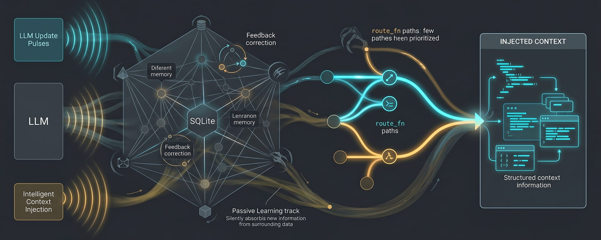

# OpenClawBrain

**Evidence, not vibes, for agent memory.**

OpenClawBrain is local, accountable memory for [OpenClaw](https://docs.openclaw.ai) agents. It remembers durable corrections, preferences, workflows, and context, then learns when that memory should affect a future turn.

> **LLM decides semantic meaning. Code enforces trust boundaries. SQLite stores the graph and evidence.**



`0.2.29` adds Memory Graph Maintenance on top of Memory Authority and the OpenClawBrain-owned Codex continuity bridge. Retrieval separates semantic relevance from whether a memory still has authority in the current turn. Graph maintenance then curates what the graph becomes over time: fewer duplicate nodes, safer edges, stale-memory proposals, scoped exceptions, tombstone-aware forgetting, and local proof for every applied mutation.

## Short version

An agent should not remember everything all the time. It should learn when memory actually matters.

OpenClawBrain turns corrections, accepted or rejected help, route misses, tool outcomes, and handoff decisions into local evidence. A teacher distills that evidence into redacted route frames. Candidate policies are tested in shadow, replayed against eval cases, calibrated by action family, then promoted only when deterministic gates pass. At runtime, the active `route-policy-v3` route_fn decides whether memory should participate; the Memory Authority resolver decides whether each retrieved memory is authorized, current, applicable, and safe enough to influence the turn.

The trust boundary is the spine:

- LLM proposes semantic meaning.
- Code owns validation, redaction, scoping, storage, replay, calibration, promotion, and rollback.
- SQLite stores the graph and the evidence trail locally.

```text
feedback and outcomes
  -> redacted route frames
  -> SQLite evidence graph
  -> shadow decisions and replay cases
  -> calibrated candidate snapshots
  -> active route-policy-v3 route_fn
  -> memory authority resolution
  -> bounded memory context or abstention
```

## Shareable blurb

```text
OpenClawBrain is my local-first memory system for AI agents.

The core idea: an agent should not just "remember everything." It should learn when memory actually matters, and maintain what it remembers. OpenClawBrain turns corrections, outcomes, misses, and handoffs into local evidence, then learns a small routing policy that decides when to bring the right memory into a future turn - or abstain when it is not confident.

The trust boundary is the important part: the LLM proposes meaning, but code owns validation, storage, calibration, promotion, rollback, and graph maintenance. SQLite keeps the graph and evidence local and inspectable.

How it works: https://openclawbrain.ai/how-it-works/
Install or upgrade: https://openclawbrain.ai/install/
Project page: https://jonathangu.com/openclawbrain/

Install/upgrade if you already run OpenClaw:
openclaw plugins install clawhub:openclawbrain@0.2.29 --force
openclaw plugins enable openclawbrain
openclaw gateway restart
```

## Install or upgrade

Requires OpenClaw `2026.5.2` or later. Use the same command for a fresh install or an upgrade; `--force` is safe when replacing an older local copy.

```bash
openclaw plugins install clawhub:openclawbrain@0.2.29 --force
openclaw plugins enable openclawbrain
openclaw gateway restart
```

If ClawHub is rate-limited or package metadata is still propagating, install the release archive instead:

```bash
curl -L -o /tmp/openclawbrain-0.2.29.tgz \
  https://github.com/jonathangu/openclawbrain/releases/download/v0.2.29/openclawbrain-0.2.29.tgz
openclaw plugins install /tmp/openclawbrain-0.2.29.tgz --force
openclaw plugins enable openclawbrain
openclaw gateway restart
```

## Verify it is live

Use runtime inspection, not just package metadata.

```bash
openclaw plugins inspect openclawbrain --runtime
openclaw doctor
# /plugins/openclawbrain/proof?limit=10
# /plugins/openclawbrain/search?query=pnpm&limit=10
```

You want to see:

- plugin loaded
- hooks and routes registered
- SQLite + FTS healthy
- no `No active memory plugin` warning from `openclaw doctor`

HTTP plugin routes are authenticated on normal OpenClaw installs. Use the authenticated dashboard/client, or pass your gateway auth header when using curl.

## Five-minute proof example

Teach one small repo rule:

```text
Use pnpm instead of npm in this repo.
```

Then check whether memory captured and can retrieve it:

```bash
openclaw plugins inspect openclawbrain --runtime
openclaw doctor
# /plugins/openclawbrain/proof?limit=10
# /plugins/openclawbrain/search?query=pnpm&limit=10
# /plugins/openclawbrain/graph?agentId=main&limit=10
# /plugins/openclawbrain/explain-last
```

A later test/build turn should receive a small bounded context block, not a transcript dump:

```xml
<openclawbrain_context>
Relevant memory:
- Must follow: Use pnpm instead of npm in this repo.
</openclawbrain_context>
```

That is the product claim: capture a durable correction, retrieve it later, attach only the relevant bounded context, and leave proof behind.

## Configuration

Recommended default mode is `balanced`.

```bash
openclaw config set plugins.entries.openclawbrain.config.enabled true --strict-json
openclaw config set plugins.entries.openclawbrain.config.mode '"balanced"' --strict-json
openclaw config set plugins.entries.openclawbrain.config.hooks.allowPromptContext true --strict-json
openclaw config set plugins.entries.openclawbrain.config.hooks.allowConversationAccess true --strict-json
openclaw config set plugins.entries.openclawbrain.config.hooks.allowToolObservation true --strict-json
openclaw config validate
openclaw gateway restart
```

### Local learning model

OpenClawBrain uses the local LLM path for semantic updates: feedback distillation, route examples, and learning. The model proposes structured JSON. Code validates, redacts, scopes, dedupes, thresholds, and writes.

Default local path is Ollama through an OpenAI-compatible endpoint:

```bash
ollama list

openclaw config set plugins.entries.openclawbrain.config.llm '{
  "enabled": true,
  "baseUrl": "http://127.0.0.1:11434/v1",
  "routeModel": "qwen2.5:32b-instruct",
  "plannerModel": "qwen2.5:32b-instruct",
  "feedbackModel": "qwen2.5:32b-instruct",
  "learningModel": "qwen2.5:32b-instruct"
}' --strict-json
openclaw config validate
openclaw gateway restart
```

If local model calls are unavailable, the main agent keeps working. Known memories can still be searched and used as bounded context; background learning gets quieter or retries later.

### Multiple agents

If you run multiple named agents/profiles, scope OpenClawBrain to all of them so each gets its own local graph:

```bash
openclaw config set plugins.entries.openclawbrain.config.scopes.agents '["main","pelican","bountiful"]' --strict-json
openclaw gateway restart
```

Use your real agent ids. Single-agent installs can skip this.

## Inspectable endpoints

| Endpoint | What it shows |
|---|---|
| `/plugins/openclawbrain/status` | whether the plugin is enabled, loaded, and how the runtime is behaving |
| `/plugins/openclawbrain/doctor` | SQLite + FTS health under the current Node runtime |
| `/plugins/openclawbrain/proof?limit=20` | recent redacted proof, route, and memory-context events |
| `/plugins/openclawbrain/search?query=...&limit=20` | local memory search |
| `/plugins/openclawbrain/graph?limit=50` | redacted memory nodes and memory edges |
| `/plugins/openclawbrain/graph/health` | graph health: duplicates, bad edges, tombstones, stale high-authority memories |
| `/plugins/openclawbrain/graph/dry-run` | creates redacted graph-maintenance proposals without mutation |
| `/plugins/openclawbrain/graph/proposals` | pending/applied/rejected maintenance proposals |
| `/plugins/openclawbrain/graph/apply?proposalId=...` | applies only low-risk deterministic proposals |
| `/plugins/openclawbrain/graph/reject?proposalId=...` | rejects a proposal without mutating the graph |
| `/plugins/openclawbrain/graph/explain?proposalId=...` | explains a proposal, its evidence, and why it is or is not safe to apply |
| `/plugins/openclawbrain/learn?limit=50` | route examples and current learning state |
| `/plugins/openclawbrain/route-teacher?limit=20` | LLM/deterministic route teacher critiques of actual route decisions |
| `/plugins/openclawbrain/route-counterfactuals?decisionId=...` | no-memory, alternate-memory, graph-depth, memory-type, stay-silent, and latency counterfactuals |
| `/plugins/openclawbrain/route-policy` | active structured `route-policy-v2` + `route-policy-v3` snapshots, v3 route frames, prototypes, and route training examples |
| `/plugins/openclawbrain/audit?limit=20` | recent capture/store/reject decisions and rejection distribution |
| `/plugins/openclawbrain/explain-last` | compact postmortem for the latest memory decision |

## Memory graph maintenance

Memory Authority answers: "Can this retrieved memory influence this turn?"

Memory Graph Maintenance answers: "After many turns, corrections, route decisions, and stale facts, how should the graph evolve?"

The engine is deliberately conservative. It runs passively in the background so maintenance does not depend on an operator remembering a chore. Each cycle records dry-run/proposal history and may apply only deterministic low-risk repairs like exact duplicate consolidation, bad edge retirement, and observation-only feedback rows. It can also propose stale high-authority review, tombstone recapture blocking, scoped exceptions, and feedback observations. Those review-gated proposals do not quietly become authority. Memory Authority still recomputes turn-level use every time.

Telegram/operator commands:

```text
/brain graph health
/brain graph dry-run
/brain graph proposals
/brain graph apply <proposalId>
/brain graph reject <proposalId>
/brain graph stale
/brain graph clusters
/brain graph tombstones
/brain graph explain <proposalId>
```

The core invariants:

- Current user instruction outranks memory.
- Connectivity is not authority.
- A behavioral edge is not proof that a fact is true.
- Tombstoned content cannot be revived by merge, proof, proposal, or LLM distillation.
- Every mutation goes through a proposal, precondition check, transaction, redacted proof event, and lineage/observation record.

## How it works

OpenClawBrain sits beside the normal OpenClaw run. It does not replace the main model; it gives the model better working memory.

```text
before_prompt_build
  → redact current turn
  → route_fn decides whether memory should participate
  → SQLite FTS + graph search finds candidates
  → memory authority resolver separates relevance from authority
  → context selector chooses a small authorized set
  → attach bounded memory context

agent_end / after_tool_call
  → distill durable feedback
  → validate and store memory updates
  → resolve outcomes
  → route teacher critiques actual route vs graph-grounded alternatives
  → counterfactuals become route training examples and v3 pairwise preferences
  → bandit feedback updates action priors
  → structured route-policy-v2/v3 snapshots update deterministic route_fn
```

The graph stores scoped memory nodes and edges: corrections, preferences, workflows, context, route examples, outcomes, and superseded facts. The authority layer adds side tables for validity and authority events so `/graph` and `/explain-last` can show not only what matched, but why it was attached, weakened, verified, confirmed, suppressed, superseded, or withheld.

## Privacy and safety

- Local learning defaults to the local Ollama path
- Raw transcript upload is hard-disabled
- Redaction happens before storage and before model use
- The model does not write directly to memory
- Relevance is not authority: stale, superseded, private, tombstoned, or locally overridden memories are not silently obeyed
- SQLite stores the graph and evidence locally
- Plugin failure should not block the main agent

## Links

- [Install](https://openclawbrain.ai/install/)
- [Proof](https://openclawbrain.ai/proof/)
- [How it works](https://openclawbrain.ai/how-it-works/)
- [Memory graph maintenance](https://openclawbrain.ai/graph-maintenance/)
- [Ultimate guide](docs/ULTIMATE_GUIDE.md)
- [Memory Authority design](docs/MEMORY_STALENESS_DECAY_AND_FORGETTING.md)
- [Memory Graph Maintenance plan](docs/MEMORY_GRAPH_MAINTENANCE_PLAN.md)
- [Architecture](docs/ARCHITECTURE.md)
- [Canonical route-fn learning system master plan](docs/ROUTE_FN_LEARNING_SYSTEM_MASTER_PLAN.md)
- [Vision](VISION.md)
- [Final plan](FINAL_PLAN.md)
- [Memory graph image](docs/assets/openclawbrain-memory-graph.jpg)
- [Getting started](docs/GETTING_STARTED.md)
- [Copy-paste install note](docs/FRIEND_INSTALL.md)

## License

MIT
