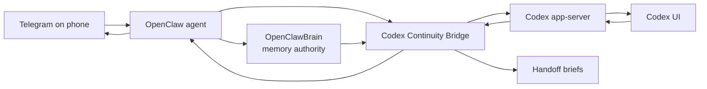

# OpenClawBrain Codex Continuity Bridge Plan

Date: 2026-05-10
Status: Direction approved; implementation should start read-only.

## Product Thesis

Jonathan's workflow has shifted. Codex UI is now the high-bandwidth workbench for deep coding sessions at the Mac. OpenClaw remains the phone-accessible operator layer through Telegram. OpenClawBrain should not fight that shift. It should make the shift coherent.

The product direction:

> Codex does the deep work. OpenClaw keeps Jonathan connected to it. OpenClawBrain decides what matters.

This is not a pivot away from OpenClawBrain. It is an application of OpenClawBrain's core idea: memory is useful only when the system can decide whether the remembered state has authority in the current context.

The new adjacent capability is:

**OpenClaw Codex Continuity Bridge**

The bridge observes local Codex app-server state, exposes a conservative status surface to OpenClaw, mirrors meaningful completion/blocker/failure events to Telegram, and later may accept Telegram-originated Codex goals behind explicit guardrails.

The first build must be read-only except for Telegram notifications explicitly requested by the user.

## Component Boundaries

### Codex UI

Codex UI remains the high-bandwidth workbench:

- deep code changes
- multi-file edits
- long-running goals
- local visual feedback
- direct user supervision at the computer

### OpenClaw

OpenClaw remains the reachable local operator:

- Telegram interaction
- local machine inspection
- status and notification delivery
- safe orchestration
- one-question clarification when needed

### OpenClawBrain

OpenClawBrain remains the memory authority layer:

- durable operating truths
- scoped preferences
- relevance versus authority
- staleness and override handling
- notification preferences
- "should this matter now?" decisions

OpenClawBrain should not become an integration dumping ground.

### Codex Continuity Bridge

The bridge is a separate plugin/service:

- connects to Codex app-server
- reads Codex threads/goals/turn state
- watches selected threads
- dedupes and classifies events
- generates handoff briefs
- sends notification requests through OpenClaw
- later, optionally, submits Codex turns/goals with explicit provenance and confirmation

## Non-Goals For The MVP

The MVP must be narrow.

Non-goals:

- Telegram is not a coding interface.
- The bridge does not stream raw Codex deltas to Telegram.
- The bridge does not pipe tool chatter, command output, or diffs into Telegram.
- The bridge does not submit Codex goals from Telegram.
- The bridge does not steer active Codex threads.
- The bridge does not bypass Codex approval or sandbox behavior.
- OpenClawBrain does not store raw Codex telemetry.
- SQLite is not a write path.
- The bridge does not infer dangerous actions from vague Telegram text.
- The bridge does not claim a fact was verified unless it observed the evidence.

The initial product should be boringly safe:

1. show what Codex is doing
2. watch a selected thread
3. send one useful completion/blocker/failure notification
4. generate evidence-separated handoff briefs

## Current Local Findings

Observed on the Mac mini:

- Codex UI is running a native `codex app-server` process.
- Codex exposes an experimental app-server protocol.
- Codex has a `codex app-server proxy` command, but the public OpenClawBrain package should not spawn it directly. App-server access should come from a host-provided reader/capability so ClawHub can scan the package without a bundled process-control surface.
- Codex generated protocol bindings include request methods such as:
  - `initialize`
  - `thread/list`
  - `thread/read`
  - `thread/start`
  - `thread/resume`
  - `thread/fork`
  - `turn/start`
  - `turn/steer`
  - `turn/interrupt`
  - `thread/inject_items`
- Codex generated protocol bindings include notifications such as:
  - `thread/started`
  - `thread/status/changed`
  - `thread/goal/updated`
  - `thread/goal/cleared`
  - `turn/started`
  - `turn/completed`
  - `item/completed`
  - `item/agentMessage/delta`
  - `turn/diff/updated`
  - `turn/plan/updated`
  - `warning`
- Codex local state includes SQLite tables:
  - `threads`
  - `thread_goals`
  - `agent_jobs`
  - `agent_job_items`
  - `jobs`
  - `stage1_outputs`
- OpenClaw can already send Telegram messages through:
  - `openclaw message send --channel telegram --target ... --message ...`
- Codex config has goals enabled.

This is enough to build read-only awareness and watched completion notifications. It is not yet enough to safely build Telegram-to-Codex control.

## Deployment And Upgrade Constraint

Important constraints discovered during cleanup:

Jonathan's current GitHub credentials can push to Jonathan-owned repos and forks, including:

- `jonathangu/openclawbrain`
- `jonathangu/opencormorant`

They cannot directly push, merge, or enable auto-merge on upstream `openclaw/openclaw` branches such as `main`, `master`, or `release/2026.5.7`.

Jonathan's personal OpenClaw install should also stay easy to upgrade to the latest upstream OpenClaw. It should not require a long-lived OpenClaw fork, local core edits, stashes, or rebases just to keep the Codex continuity bridge working.

That means the bridge plan must not assume "edit OpenClaw master and deploy." It also should not assume "run a forked OpenClaw forever." The safe deployment model is:

1. Keep `/Users/guclaw/openclaw` on a clean upstream-tracking OpenClaw branch.
2. Put Codex continuity code in an OpenClawBrain-owned external plugin/tool package.
3. Install or update that plugin through normal OpenClaw extension/plugin configuration.
4. Use a fork/PR against upstream OpenClaw only when a small host capability is truly missing.
5. Treat upstream OpenClaw merge as maintainer-owned and optional, not required for Jonathan's local workflow.
6. Keep OpenClawBrain docs and Jonathan-owned site/docs/tool repos directly publishable by Jonathan's credentials.

Operationally, OpenClawBrain should remember:

- OpenClaw upstream is not directly writable from this environment.
- Jonathan's personal OpenClaw checkout should remain stock/upstream-trackable.
- Local OpenClaw core edits are prototype/reference only, not the product deployment path.
- OpenClawBrain-owned tools/plugins are the correct path for controlled shipping.
- Fork branches and PRs are the fallback path for OpenClaw host changes.
- Do not promise an upstream OpenClaw merge unless a maintainer with permission has merged it.
- Do not make the local OpenClaw upgrade path depend on stashing or rebasing bridge edits.

The Codex Continuity Bridge can be prototyped against OpenClaw internals, and the prototype can be packaged as a PR, but the durable product should live under OpenClawBrain control. "Merged to OpenClaw master" is outside this agent's current authority and should not be required for Jonathan to use the bridge.

## MVP Definition

The MVP should be split into two milestones.

### Phase 1A: Read-Only Snapshot

Build:

- `GET /plugins/openclawbrain/codex/status`
- `GET /plugins/openclawbrain/codex/threads`
- app-server connection
- SQLite read-only fallback
- normalized thread/goal status
- Telegram command: `/brain codex status`

No watcher. No Telegram push notifications. No write path.

Success:

- OpenClaw can answer from Telegram with a concise Codex status.
- If app-server is unavailable, it says the result is stale/offline rather than pretending it is current.

### Phase 1B: Watched Completion Mirror

Build:

- watch registry
- event subscription or polling
- event classifier
- dedupe
- redaction
- one completion/blocker/failure Telegram notification for watched threads
- offline backfill for missed terminal states

Success:

- Jonathan can ask OpenClaw to watch a Codex thread.
- Codex finishes, blocks, or fails.
- Jonathan receives exactly one useful Telegram notification.

This is the first truly useful ship.

## Architecture



The bridge should be implemented as an OpenClawBrain-owned external OpenClaw plugin/service or companion tool package, not as a patch to OpenClaw core.

OpenClawBrain stores policies and durable memories. The bridge stores transient event/watch state. OpenClaw provides the host runtime, command ingress, and Telegram transport, but should remain stock and easy to upgrade.

## Read-Only Protocol Compatibility Strategy

Codex app-server is experimental. The bridge must isolate protocol risk.

### Initialize And Capability Detection

On startup:

1. Prefer a host-provided app-server reader/capability when OpenClaw exposes one. Do not bundle direct process spawning in the public package.
2. Send `initialize`.
3. Record protocol/server version if available.
4. Build a capability map:
   - `canListThreads`
   - `canReadThread`
   - `canListLoadedThreads`
   - `canSubscribeNotifications`
   - `canStartThread`
   - `canStartTurn`
   - `canSteerTurn`
5. Disable any feature whose required capability is missing.

For Phase 1A and 1B, only read/subscription capabilities should be required.

### Authoritative Source Rules

When app-server and SQLite disagree:

- If app-server is connected and returns thread state, app-server wins.
- If app-server says a thread is running but SQLite has no new row, app-server wins.
- If app-server is unavailable, SQLite may provide stale awareness only.
- SQLite fallback responses must include:
  - `source: "sqlite_fallback"`
  - `stale: true`
  - `observedAt`
  - `lastUpdatedAt`
- SQLite must never be used for writes.
- Telegram-originated writes are forbidden unless app-server write capability is explicitly confirmed.

### Contract Tests

Maintain captured protocol fixtures for:

- initialization success
- initialization with missing capability
- thread list success
- thread read success
- goal update notification
- turn completed notification
- method missing
- malformed event
- disconnect/reconnect

The bridge should fail soft on protocol drift.

## State Model

The bridge should keep its own SQLite database. Do not overload OpenClawBrain with raw Codex events.

### `codex_threads_seen`

Tracks known threads.

Fields:

- `thread_id`
- `session_id`
- `cwd`
- `name`
- `preview`
- `source`
- `status`
- `model`
- `created_at`
- `updated_at`
- `last_seen_at`
- `last_source`
- `stale`

### `codex_goal_state`

Tracks current and historical goals. Codex goal IDs may not always be stable or available, so the schema must support nullable IDs.

Fields:

- `goal_key`
- `goal_id`
- `thread_id`
- `objective`
- `status`
- `token_budget`
- `tokens_used`
- `time_used_seconds`
- `created_at`
- `updated_at`
- `first_seen_at`
- `last_seen_at`
- `last_notified_status`

Derived key:

```text
goal_key = hash(thread_id + objective + created_at_or_first_seen_at)
```

### `codex_watch`

Tracks notification subscriptions.

Fields:

- `watch_id`
- `scope`
- `thread_id`
- `repo_path`
- `goal_key`
- `notify_target`
- `notify_channel`
- `policy`
- `verbosity`
- `sensitivity`
- `created_by`
- `created_at`
- `expires_at`
- `expires_reason`
- `last_event_at`
- `last_notified_at`
- `dedupe_key_last_seen`

Allowed values:

- `scope`: `thread | repo | goal`
- `verbosity`: `completion_only | blockers_and_completion | periodic_digest`
- `sensitivity`: `normal | sensitive | no_telegram_details`

### `codex_bridge_events`

Audit trail.

Fields:

- `event_id`
- `event_type`
- `event_class`
- `thread_id`
- `turn_id`
- `goal_key`
- `source`
- `summary`
- `raw_ref`
- `retention_class`
- `privacy_class`
- `created_at`

Event types:

- `thread_seen`
- `goal_seen`
- `goal_completed`
- `goal_failed`
- `turn_completed`
- `blocked`
- `approval_required`
- `auth_failure`
- `telegram_notified`
- `telegram_suppressed`
- `goal_submitted_from_telegram`
- `handoff_generated`

Event classes:

- `noisy_progress`
- `meaningful_progress`
- `completion`
- `failure`
- `blocker`
- `approval_required`
- `auth_failure`
- `safety_boundary`
- `user_requested_watch_update`

### Retention Policy

Retention must be explicit:

- raw event references: short retention
- normalized bridge summaries: medium retention
- watch records: until expiration plus audit window
- durable OpenClawBrain memories: explicit capture only

`raw_ref` must not become an accidental permanent archive of sensitive data. It should point to local evidence when needed, but summaries should avoid storing raw logs or diffs.

## Notification Policy

Telegram is a low-bandwidth operator surface. The bridge should not make it noisy.

### Event Classification

Every Codex event should be classified before notification logic.

```text
event -> event_class -> policy -> notification decision
```

Event classes:

- `noisy_progress`: tool calls, stream deltas, token updates
- `meaningful_progress`: plan milestone, major state transition
- `completion`: turn or goal complete
- `failure`: failed turn, failed goal, failed command if terminal
- `blocker`: needs user decision
- `approval_required`: Codex or bridge needs approval
- `auth_failure`: login/token issue
- `safety_boundary`: request rejected by policy
- `user_requested_watch_update`: explicit status/digest request

Default:

```text
notify = watch.active
  && event_class in watch.allowed_classes
  && !deduped
  && !redacted_to_empty
```

### Notify By Default Only For Watched Threads

Send Telegram messages for:

- watched completion
- watched failure
- watched blocker
- watched approval requirement
- explicit status request

Do not notify for:

- every tool call
- every file edit
- every plan update
- token usage churn
- streaming deltas
- ordinary command output
- repetitive retry logs
- low-risk progress

### Dedupe Keys

Use stable dedupe keys:

- `thread_id:event_class:turn_id`
- `thread_id:goal_status:goal_updated_at`
- `watch_id:terminal_status`
- `thread_id:blocker_kind`

### Delayed Notifications

If completion happens while bridge is offline:

> Delayed update: Codex finished the watched goal while the bridge was offline. Final status: complete. Updated 42 minutes ago.

Send at most one missed terminal-state notification per watch.

## Security And Threat Model

Telegram-to-Codex is a remote control path into a local coding agent. Treat it that way.

### Threats

Explicitly model:

- Telegram account compromise
- spoofed sender
- wrong chat ID
- replayed commands
- accidental forwarding
- malicious prompt injection from Codex output
- commands hidden inside summaries
- bridge route exposure on localhost
- bridge route exposure on LAN
- long-running token/cost abuse
- wrong repo selection
- wrong thread selection
- branch/repo dirty state
- deploy/publish/delete/trade/secrets actions
- local malware calling bridge routes

### Default Security Posture

Phase 1A and 1B:

- read-only with respect to Codex
- bridge API local-only
- bridge API authenticated even on localhost
- Telegram notifications only for explicit watches
- no Telegram-originated Codex writes

### Mutating Actions Later

When write mode is eventually added, require:

- explicit feature flag
- repo allowlist
- trusted sender allowlist
- provenance metadata
- risk classification
- confirmation for ambiguous or risky actions
- local Mac approval or stronger second factor for high-risk actions

High-risk operations:

- deploy
- publish
- delete
- reset
- trade
- access secrets
- send external messages
- spend money
- change auth/config

### Confirmation Alone Is Not Enough

If Telegram account compromise is in scope, a Telegram confirmation is weak. For high-risk write actions, require at least one:

- local Mac approval
- repo allowlist plus trusted chat ID plus confirmation phrase
- read-only-from-Telegram mode unless manually unlocked
- side-effect class enforcement

### Route Exposure

The bridge HTTP API should:

- bind to localhost by default
- require an auth token even on localhost
- reject LAN exposure unless explicitly configured
- log every mutating request
- disable dev/test notification routes by default

Any future notification test route must be dev-only or admin-token-only.

## Provenance For Mutating APIs

Every future mutating endpoint must include provenance metadata.

Example:

```json
{
  "requestedBy": "telegram:Jonathan",
  "requestId": "telegram-message-id-or-uuid",
  "sourceMessageId": "...",
  "confirmed": true,
  "confirmationMethod": "telegram-double-confirm",
  "riskClass": "low",
  "createdAt": "2026-05-10T10:00:00Z"
}
```

Mutating APIs without provenance should be rejected.

## Thread And Repo Selection Model

Wrong thread selection is the most dangerous non-security failure mode.

Do not rely on "active thread" intuition for write paths.

### Selection Score

When selecting a target thread:

- loaded in Codex UI: `+40`
- active/running: `+30`
- cwd matches recent OpenClaw context: `+25`
- repo path explicitly mentioned: `+30`
- goal text semantically matches request: `+20`
- updated in last 30 minutes: `+10`
- thread was previously watched by this Telegram chat: `+10`
- dirty repo with user changes: confirmation required
- active thread is running unrelated work: confirmation required
- multiple candidates within 20 points: confirmation required

### Confirmation Format

Confirmation must show exact target:

```text
I found an active Codex thread:

Repo: /Users/guclaw/...
Branch: memory-authority
Goal: Finish settings migration
Status: idle, updated 6m ago

Send your instruction there?
```

For ambiguous cases:

```text
I found 2 plausible Codex threads. I need you to pick one before I send anything.
```

### Read-Only Selection

For status requests, thread selection can be looser. The bridge may show multiple active/recent candidates instead of forcing a single answer.

## Handoff Brief Evidence Rules

Handoff briefs must separate observed evidence from Codex claims.

### Observed Facts

Facts the bridge observed directly:

- repo path
- branch
- dirty files
- last commit
- thread ID
- goal status
- commands seen in events
- test output seen in events
- app-server reported status
- timestamps

### Codex-Reported Claims

Claims from Codex final answer:

- "I updated X"
- "tests passed"
- "deployment succeeded"
- "this is done"

These should be labeled as reported unless independently observed.

Example:

```text
Codex reported that tests passed, but the bridge did not independently verify the command output.
```

### OpenClawBrain Interpretation

Interpretation should be clearly separate:

- likely next action
- whether this seems notify-worthy
- whether a fact should become durable memory
- whether a blocker matters

### Brief Template

```md
# Codex Handoff Brief

Generated: 2026-05-10 03:10 PT

## Current Goal

...

## Observed Facts

- Repo:
- Branch:
- Dirty files:
- Thread:
- Goal status:

## Codex-Reported Claims

- ...

## Independently Observed Evidence

- Commands:
- Tests:
- Diff:

## Blockers

- ...

## OpenClawBrain Interpretation

- ...

## Next Actions

1. ...
2. ...
3. ...
```

## Memory Authority Storage Boundaries

OpenClawBrain should store durable operating truths, not telemetry.

### Store As Durable Memory

Store only when stable or repeated:

- Jonathan uses Codex UI as the high-bandwidth workbench.
- Telegram is a low-bandwidth remote command surface.
- OpenClaw should notify only on completion, blocker, failure, approval, or explicit watch.
- OpenClawBrain should not stream raw Codex tool chatter.
- Handoff briefs should separate observed facts from Codex-reported claims.

Recommended metadata:

- memory type: operating policy
- confidence: medium-high
- authority: durable but overridable
- validation: user-confirmed
- scope: user/global or project-specific

### Do Not Store As Durable Memory

Do not store:

- raw Codex messages
- command output
- full diffs
- transient thread status
- temporary watch requests
- one-off repo paths unless repeatedly used
- secrets or auth failures
- failed guesses about user intent
- raw Telegram commands beyond audit retention

### Override Rule

Current instruction wins.

If durable memory says "Telegram summaries should be concise" and Jonathan asks for a deep critique, the current instruction dominates for that turn.

## API Shape

### Read-Only MVP Routes

#### `GET /plugins/openclawbrain/codex/status`

Returns current status.

Required response fields:

- `ok`
- `source`
- `stale`
- `observedAt`
- `appServerStatus`
- `activeThreads`
- `latestThread`
- `warnings`

#### `GET /plugins/openclawbrain/codex/threads`

Returns recent threads.

Filters:

- `active`
- `loaded`
- `cwd`
- `updatedSince`
- `watched`

#### `/brain codex watch`

Registers a watch through the OpenClawBrain plugin command. This is not a Codex write; it writes bridge-local state only.

Requires:

- authenticated OpenClaw caller
- notify target
- watch scope
- expiration or default TTL

### Later Mutating Routes

Feature-flagged only:

- `/brain codex goal`
- `/brain codex steer`

Must require provenance and confirmation metadata.

## Offline And Backfill Behavior

The bridge must handle:

- Codex completes while bridge is down.
- Telegram send fails.
- app-server disconnects.
- Mac sleeps.
- SQLite schema changes.
- watch expires while offline.

### Startup Backfill

On startup:

1. Load active watches.
2. Query app-server if available.
3. Query SQLite fallback.
4. Compare latest known terminal state with watch state.
5. Send at most one delayed notification per watch.

### Telegram Send Failure

If Telegram send fails:

- record `telegram_send_failed`
- retry with bounded backoff
- do not duplicate after success
- expose failure in `/brain codex status` and `/plugins/openclawbrain/codex/status`

### Watch Expiration

If a watch expires offline:

- do not send progress updates after expiration
- send terminal notification only if terminal event occurred before expiration and policy allows
- record `expires_reason`

## Implementation Phases

### Phase 0: Memory Capture

Store the durable operating truths in OpenClawBrain:

- Codex UI is high-bandwidth workbench.
- OpenClaw is phone-accessible operator layer.
- Telegram is concise command/status surface.
- Do not stream noisy Codex telemetry.
- Prefer final/blocker/failure summaries.

Deliverable:

- visible memories in graph/status
- authority behavior documented

### Phase 1A: Read-Only Snapshot

Build bridge plugin under OpenClawBrain ownership:

- app-server client
- protocol capability map
- SQLite fallback reader
- `GET /plugins/openclawbrain/codex/status`
- `GET /plugins/openclawbrain/codex/threads`
- `/brain codex status` Telegram command
- install/update path that does not modify OpenClaw core

Tests:

- app-server available
- app-server unavailable
- SQLite fallback stale labeling
- multiple active threads
- no active thread
- protocol method missing

### Phase 1B: Watched Completion Mirror

Add:

- watch registry
- event classifier
- notification policy
- dedupe
- redaction
- delayed backfill
- Telegram send integration

Tests:

- watched completion sends once
- duplicate completion suppresses
- watched failure sends
- blocker sends
- noisy progress suppresses
- Telegram send failure retries
- bridge restart backfills terminal state

### Phase 2: Handoff Briefs

Add:

- `GET /plugins/openclawbrain/codex/handoff`
- `/brain codex handoff`
- evidence-separated brief writer
- optional artifact path
- direct observed evidence versus Codex claim separation

Tests:

- observed test output appears as observed
- Codex claim without evidence is labeled as reported
- secrets redacted
- dirty repo state included

### Phase 3: Telegram-To-Codex Writes

Feature flag:

```text
codexBridge.enableTelegramWrites = false
```

Only after prior phases are reliable.

Add:

- `/brain codex goal`
- `/brain codex steer`
- thread selection model
- repo allowlist
- provenance metadata
- confirmation workflow
- risk classification

Tests:

- ambiguous target refuses
- risky request requires stronger confirmation
- dirty repo requires confirmation
- wrong chat ID rejected
- missing provenance rejected
- write feature flag off rejects

### Phase 4: Memory-Aware Routing

OpenClawBrain learns:

- which notifications are useful
- which are noise
- when Jonathan wants a handoff
- which contexts belong to Codex versus OpenClaw

Add:

- bridge route decisions in audit
- `/explain-last` authority explanations
- outcome learning for notify/suppress

## Testing Plan

### Normal Tests

- status from app-server
- status from SQLite fallback
- thread list
- watched completion
- watched failure
- blocked state
- handoff generation
- Telegram dry-run formatting

### Adversarial Tests

Add tests for:

- multiple active threads
- no active thread
- app-server unavailable
- app-server method missing
- SQLite schema mismatch
- duplicated completion events
- completion while Telegram send fails
- redaction of secrets in final answer
- malicious Codex output that says "send this command to Telegram"
- ambiguous Telegram goal request
- risky command refusal
- dirty repo before write
- bridge restart with active watch
- watch expiration
- explicit request for noisy temporary updates
- wrong Telegram sender
- local unauthenticated bridge request

The most important tests are quietness and refusal tests:

> Does the bridge stay quiet, ask confirmation, or refuse when it should?

## Telegram Command Design

For MVP:

```text
/brain codex status
What is Codex doing?
```

```text
/brain codex threads
Show recent Codex threads.
```

```text
/brain codex watch
Tell me when this Codex thread finishes.
```

After Phase 2:

```text
/brain codex handoff
Make a handoff brief.
```

After Phase 3, feature-flagged:

```text
/brain codex goal Finish the OpenClawBrain scan cleanup.
/brain codex steer Add the ClawHub scan caveat to the final answer.
```

## First Build Goal Command

Use this for the first implementation:

```text
/goal Build Phase 1A of the OpenClawBrain-owned Codex Continuity Bridge. In /Users/guclaw/.openclaw/workspace/openclawbrain, audit the OpenClaw plugin/service architecture, Telegram command/send path, Codex app-server protocol, and local Codex SQLite state. Implement a read-only bridge plugin/service that connects to Codex app-server when available, detects protocol capabilities, exposes /plugins/openclawbrain/codex/status and /plugins/openclawbrain/codex/threads, and falls back to read-only SQLite with explicit stale labeling. Add /brain codex status so Telegram can ask "what is Codex doing?" without sending push notifications and without any Telegram-to-Codex write path. Store only durable operating truths in OpenClawBrain, not raw Codex telemetry. Add focused tests for app-server available/unavailable, method missing, multiple active threads, no active thread, stale SQLite fallback, and redaction. Verify local plugin loading and document Phase 1B watched completion mirror as the next step.
```

Use this only after Phase 1A is stable:

```text
/goal Build Phase 1B of the OpenClaw Codex Continuity Bridge: watched completion mirror. Add a bridge-local watch registry, event classifier, dedupe, redaction, and Telegram notification policy for explicit watches only. Watch Codex app-server events for turn/goal completion, failure, blocker, and approval-needed states; suppress noisy progress/tool/delta events. Add offline backfill so a watched terminal state missed during bridge downtime sends at most one delayed notification. Add tests for duplicate events, Telegram send failure, redaction, app-server disconnect/reconnect, watch expiration, and quietness/refusal cases. Do not implement Telegram-to-Codex goal submission yet.
```

## Bottom Line

The direction is strong. The first useful ship is not remote-controlling Codex from Telegram. It is awareness and continuity:

- What is Codex doing?
- Did the watched goal finish?
- Did it fail or block?
- What should Jonathan know when he returns to the Mac?

Only after that is reliable should the system accept Telegram-originated Codex goals.

This keeps the product sharp and safe:

> Codex UI remains the workbench. OpenClaw remains the mobile operator. OpenClawBrain decides what matters. The bridge connects them without turning Telegram into a noisy remote coding console.
