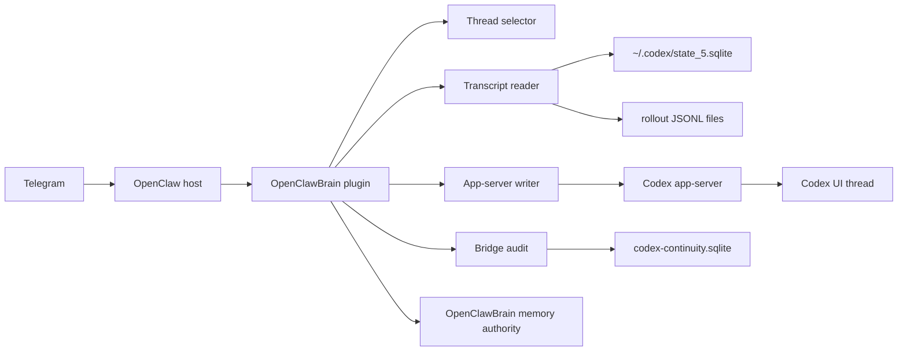

# Codex Telegram Full Bridge Plan

Status: design plan after local code audit  
Date: 2026-05-11  
Owner: OpenClawBrain

## Executive Summary

The current OpenClawBrain Codex continuity feature is useful, but it is only half of the bridge Jonathan actually wants.

Today it can answer:

- What Codex threads/goals are visible?
- Which goal looks active or complete?
- Can OpenClaw send a quiet completion/blocker notification?
- Can OpenClaw produce a conservative handoff brief?

It cannot yet answer the two most important Telegram operator questions:

- "What did Codex just say in that UI thread?"
- "Send this exact message into that Codex UI thread as if I were at the computer."

That means the current bridge is not good enough for the mobile workflow. It watches metadata, not the conversation. It refuses writes. It sees goals, not the actual recent messages.

The product target should be:

> OpenClawBrain lets Telegram act as a low-bandwidth remote console for Codex UI threads: read recent Codex messages directly, forward selected new messages to Telegram, and send user messages into a specific Codex thread through the Codex app-server, without modifying OpenClaw core and without storing raw Codex telemetry as durable memory.

## What The Code Shows Today

### OpenClawBrain Current State

File: `/Users/guclaw/.openclaw/workspace/openclawbrain/packages/openclaw-plugin/src/codex-continuity.ts`

The current bridge does these things:

- Reads `~/.codex/state_5.sqlite`.
- Queries `threads` and `thread_goals`.
- Returns thread id, title, cwd, branch, model, reasoning effort, goal objective, and goal status.
- Labels SQLite fallback as stale/read-only.
- Supports `/brain codex status`.
- Supports `/brain codex threads`.
- Supports `/brain codex watch`.
- Supports `/brain codex handoff`.
- Stores bridge-local watches and redacted bridge events.
- Refuses `/brain codex goal` and `/brain codex steer` unless write feature flags are enabled, and even then the implementation still returns "not enabled in this build path."

The current bridge does not:

- Read `threads.rollout_path`.
- Parse the per-thread Codex transcript JSONL.
- Return recent user/assistant messages.
- Tail message changes.
- Forward assistant messages to Telegram.
- Connect to Codex app-server directly.
- Call `thread/resume`.
- Call `turn/start`.
- Call `turn/steer`.
- Write user text into a Codex thread.

### Codex Local State Has The Missing Transcript Pointer

SQLite table: `/Users/guclaw/.codex/state_5.sqlite`

The `threads` table includes a `rollout_path` column. The current OpenClawBrain query ignores it.

Example local path:

```text
/Users/guclaw/.codex/sessions/2026/05/08/rollout-2026-05-08T09-50-06-019e087f-152a-7300-99c1-8623f0152f39.jsonl
```

Those rollout JSONL files contain the actual thread transcript records. The useful message records include:

- `response_item` with `payload.type == "message"`
- `payload.role == "user"` or `payload.role == "assistant"`
- content items such as `input_text` and `output_text`
- `event_msg` records such as `user_message` and `agent_message`

This means recent Codex messages can be copied directly from local files. No LLM call is needed to paste recent messages into Telegram. In fact, using an LLM for this would be worse: slower, more expensive, and more likely to paraphrase when Jonathan wants exact thread text.

### OpenClaw Codex Extension Already Has The Write Surface

Files inspected:

- `/Users/guclaw/openclaw/extensions/codex/src/app-server/protocol.ts`
- `/Users/guclaw/openclaw/extensions/codex/src/app-server/client.ts`
- `/Users/guclaw/openclaw/extensions/codex/src/app-server/request.ts`
- `/Users/guclaw/openclaw/extensions/codex/src/app-server/thread-lifecycle.ts`
- `/Users/guclaw/openclaw/extensions/codex/src/app-server/run-attempt.ts`
- `/Users/guclaw/openclaw/extensions/codex/src/conversation-binding.ts`
- `/Users/guclaw/openclaw/extensions/codex/src/conversation-control.ts`
- `/Users/guclaw/openclaw/extensions/codex/src/command-handlers.ts`

The Codex app-server protocol supports:

- `thread/list`
- `thread/start`
- `thread/resume`
- `turn/start`
- `turn/steer`
- `turn/interrupt`
- `turn/completed` notifications
- `item/agentMessage/delta` notifications
- `item/completed` notifications

The OpenClaw Codex extension already has a native conversation binding:

- `/codex threads`
- `/codex resume <thread-id>`
- `/codex bind [thread-id]`
- `/codex detach`
- `/codex binding`
- `/codex stop`
- `/codex steer <message>`

The implementation proves that sending text into a Codex thread is feasible through `turn/start` and `turn/steer`. OpenClawBrain simply does not use that path yet.

## Verdict

Jonathan is right: the current Codex continuity feature is incomplete.

The current implementation is a status mirror. The desired product is a thread bridge.

The missing pieces are:

1. Recent message read/copy.
2. Message-level watches.
3. Direct Telegram-to-Codex thread writes.
4. Specific thread targeting.
5. Safe provenance, confirmation, and audit.
6. A clear decision on whether OpenClawBrain talks to Codex app-server directly or through a Codex-side companion.

## Do We Need A Codex Plugin Too?

Not immediately for the first useful version. Possibly yes for the best long-term version.

There are three implementation options.

### Option A: OpenClawBrain-Only Bridge

OpenClawBrain reads:

- `~/.codex/state_5.sqlite`
- `threads.rollout_path`
- per-thread rollout JSONL

OpenClawBrain writes:

- to Codex app-server using a small local JSON-RPC client
- never to SQLite
- never to rollout JSONL

Pros:

- No OpenClaw core changes.
- No Codex plugin install required.
- Fits the current OpenClawBrain package boundary.
- Can ship quickly.
- Directly solves recent-message copy and basic send-to-thread.

Cons:

- Polling JSONL is less elegant than event subscription.
- The app-server protocol is not a formal public API.
- OpenClawBrain must implement a small protocol adapter and capability detection.
- It may not perfectly match UI state if Codex Desktop changes how it persists transcripts.

### Option B: Reuse The OpenClaw Codex Extension More Directly

OpenClawBrain could delegate writes to the already-installed OpenClaw Codex extension.

Pros:

- Avoids duplicating app-server protocol code.
- Reuses existing `thread/resume`, `turn/start`, `turn/steer`, and collector logic.
- Stays aligned with OpenClaw's Codex host behavior.

Cons:

- OpenClawBrain package does not currently depend on OpenClaw extension internals.
- Importing from `/Users/guclaw/openclaw/extensions/codex` would make the plugin brittle and personal-machine-specific.
- ClawHub/public package should not rely on local OpenClaw source paths.

This is useful as reference, not as the shipped dependency path.

### Option C: Codex-Side Companion Plugin

Build an OpenClawBrain-owned Codex companion plugin/tool that runs on the Codex side and exposes a stable local bridge API:

- list threads
- read recent messages
- subscribe to new assistant messages
- submit a user message
- return turn completion text

Pros:

- Best long-term architecture.
- Codex-side code can see the live app-server event stream cleanly.
- Less polling.
- Cleaner "UI thread to Telegram" parity.
- Easier to keep message watches exact and low-latency.

Cons:

- More moving parts.
- Requires Codex plugin install/update workflow.
- Needs careful auth between OpenClawBrain and the companion.
- May be too much before the basic bridge is working.

### Recommendation

Build Option A first, designed so Option C can replace the internals later.

The first release should be an OpenClawBrain-owned bridge with:

- transcript reader from SQLite `rollout_path` plus JSONL
- message-level Telegram commands
- message-level watches
- app-server write client behind feature flags
- strong provenance and audit

Then build the Codex-side companion only if polling JSONL and app-server requests are not reliable enough.

## Product Contract

Telegram is not a second Codex UI.

Telegram should become:

- a remote status console
- a recent-message viewer
- a selective assistant-message mirror
- a way to send concise instructions into an exact Codex thread
- a way to ask OpenClawBrain what happened and why it notified or stayed quiet

Telegram should not become:

- a raw stream of every tool call
- a full code review surface
- an unguarded remote executor
- a place where every Codex delta appears
- a durable store of all Codex transcript data

## Architecture



The bridge should have two separate lanes.

### Lane 1: Transcript Lane

Purpose: read and forward messages.

Data source:

- SQLite thread metadata
- `threads.rollout_path`
- rollout JSONL files
- optional app-server event stream later

Rules:

- Direct copy by default.
- No LLM call for message copy.
- Do not summarize unless the user explicitly asks for a summary.
- Do not store raw transcript as durable memory.
- Store only cursors, hashes, thread refs, and redacted audit snippets.
- Omit system/developer instructions by default.
- Omit reasoning/tool chatter by default.
- Include tool output only when explicitly requested.

### Lane 2: Control Lane

Purpose: send user text to a specific Codex thread.

Write path:

- `thread/resume` to confirm target exists
- `turn/start` to submit a new user message to an idle thread
- `turn/steer` only for an active turn with known `expectedTurnId`
- `turn/interrupt` only behind explicit confirmation

Rules:

- Never write SQLite.
- Never write rollout JSONL.
- Never bypass Codex sandbox or approval behavior.
- Never enable full-access/yolo mode from Telegram by default.
- Require exact thread targeting or explicit confirmation.
- Require trusted Telegram sender.
- Require repo allowlist for side-effect-capable writes.
- Record provenance and audit.

## New Command Surface

The command namespace should stay under `/brain codex` so the user does not need to remember which plugin owns the workflow.

### Read Commands

```text
/brain codex status
/brain codex threads [filter]
/brain codex messages [thread-id|--latest|--bound] [--limit 5] [--role assistant|user|all]
/brain codex last [thread-id|--latest|--bound]
/brain codex tail [thread-id|--latest|--bound] [--assistant-only]
/brain codex handoff [thread-id|--latest|--bound]
```

Behavior:

- `messages` prints recent transcript messages directly from JSONL.
- `last` prints the latest assistant message.
- `tail` creates a message-level watch that forwards new assistant messages.
- `handoff` may use transcript snippets as evidence, but it must label exact messages versus interpretation.

### Watch Commands

```text
/brain codex watch [thread-id|--latest|--bound] --terminal
/brain codex watch [thread-id|--latest|--bound] --messages
/brain codex watch [thread-id|--latest|--bound] --all
/brain codex unwatch <watch-id|thread-id>
/brain codex watches
```

Default should remain quiet:

- terminal completion
- failure
- blocker
- approval needed
- auth failure

Message watches are explicit:

- forward new assistant final messages
- optionally forward user messages sent from Codex UI
- do not forward raw tool output unless requested

### Write Commands

```text
/brain codex send <thread-id|--latest|--bound> <message>
/brain codex reply <message>
/brain codex steer <thread-id|--bound> <message>
/brain codex goal [thread-id|--new] <goal text>
```

Behavior:

- `send` starts a new turn in the selected thread.
- `reply` sends to the current bound/watched/latest unambiguous thread.
- `steer` sends into an active running turn only when the bridge knows the active turn id.
- `goal` submits a `/goal ...` text message or starts a new thread only after the app-server write contract is verified.

Write mode should be disabled by default in the public package and enabled explicitly in Jonathan's local config.

## Transcript Reader Design

### Extend Thread Metadata

`CodexThreadSummary` needs fields like:

```ts
rolloutPath?: string;
firstUserMessage?: string;
sourcePath?: string;
```

The SQLite query should include:

```sql
t.rollout_path,
t.first_user_message,
t.thread_source
```

### Message Model

```ts
type CodexTranscriptMessage = {
  id: string;
  threadId: string;
  role: "user" | "assistant";
  text: string;
  timestamp: string;
  source: "rollout_jsonl" | "app_server";
  lineNumber?: number;
  byteOffset?: number;
  turnId?: string;
  itemId?: string;
  messageKind: "final_message" | "telegram_event" | "ui_event";
  redactedPreview: string;
};
```

### JSONL Parsing Rules

Read these by default:

- `response_item` where `payload.type == "message"`
- role `user` or `assistant`
- content item types `input_text` and `output_text`

Consider these as fallback/event evidence:

- `event_msg` with `payload.type == "user_message"`
- `event_msg` with `payload.type == "agent_message"`

Ignore by default:

- `session_meta`
- system/developer instruction blocks
- `reasoning`
- tool call records
- tool result records
- token-count events
- raw screenshots/media metadata unless explicitly requested

### Direct Copy, No LLM

When the user asks for recent messages, the bridge should:

1. Resolve the thread.
2. Read the rollout file.
3. Parse message records.
4. Filter to requested roles.
5. Chunk for Telegram limits.
6. Send exact text with minimal framing.

It should not call a model.

This is important for cost, latency, and fidelity.

## App-Server Writer Design

### Capability Detection

On startup or first write attempt, the bridge should detect:

- app-server reachable
- protocol initialized
- `thread/list` available
- `thread/resume` available
- `turn/start` available
- `turn/steer` available
- notifications available

The status payload should report:

```json
{
  "canReadThreads": true,
  "canReadMessages": true,
  "canStartTurn": true,
  "canSteerTurn": false,
  "canSubscribe": false,
  "canWrite": true
}
```

### Write Flow: Idle Thread

```mermaid
sequenceDiagram
  participant TG as Telegram
  participant OCB as OpenClawBrain
  participant SEL as Thread Selector
  participant APP as Codex App-Server
  participant UI as Codex UI

  TG->>OCB: /brain codex send thread-123 "Please continue"
  OCB->>SEL: verify target thread
  SEL-->>OCB: exact match, repo allowed
  OCB->>APP: initialize
  OCB->>APP: thread/resume(thread-123)
  APP-->>OCB: thread ok
  OCB->>APP: turn/start(thread-123, input text)
  APP-->>OCB: turn id
  APP-->>UI: new turn appears
  OCB-->>TG: Sent to Codex thread thread-123; watching reply
```

### Write Flow: Active Turn

If there is an active turn and the bridge has the active turn id:

- use `turn/steer`
- include `expectedTurnId`
- record as steer, not new turn

If there is an active turn but no known turn id:

- refuse or queue
- do not guess

Recommended behavior:

```text
That Codex thread appears active, but I do not have the active turn id.
I can queue this after completion, or you can target an idle thread.
```

### New Thread Flow

New thread creation should be later than send-to-existing-thread.

It requires:

- cwd/repo selection
- model selection or default
- sandbox and approval defaults
- feature flag
- confirmation

## Thread Selection Model

Wrong-thread writes are the main product risk.

Selection order:

1. Exact thread id supplied by user.
2. Current Telegram conversation binding.
3. Explicit active watch for this Telegram chat.
4. Latest active goal in current repo context.
5. Latest updated Codex thread.

Scoring should be explainable:

```text
explicit thread id: +100
current conversation binding: +80
active watch in same Telegram chat: +70
repo/cwd matches recent OpenClaw context: +35
goal/title matches user text: +20
updated within 30 minutes: +20
active goal: +15
same branch as current worktree: +10
archived: disqualify
repo not allowlisted for writes: disqualify for writes
multiple candidates within 20 points: require confirmation
```

Confirmation should show:

```text
Target Codex thread:
Thread: 019e...
Title: Finish OpenClawBrain bridge
Repo: /Users/guclaw/.openclaw/workspace/openclawbrain
Branch: main
Updated: 6 minutes ago

Send your message there?
```

## Safety Model

Telegram-to-Codex is remote control of a local coding agent. It must be treated as high-trust but not casual.

### Required For Writes

- `codexBridge.enableTelegramWrites = true`
- trusted Telegram sender/chat id
- target thread exact or confirmed
- repo allowlist match
- app-server write capability confirmed
- provenance metadata recorded
- risk classification performed
- no SQLite write path
- no Codex approval bypass

### Provenance

Every write attempt should record:

```json
{
  "requestedBy": "telegram:Jonathan",
  "sourceMessageId": "...",
  "telegramChatId": "...",
  "targetThreadId": "...",
  "targetRepo": "...",
  "requestId": "...",
  "riskClass": "low|medium|high",
  "confirmationState": "not_required|requested|confirmed|rejected",
  "appServerMethod": "turn/start",
  "createdAt": "..."
}
```

### Risk Classes

Low:

- ask Codex for status
- paste a clarifying message
- ask for a summary
- ask Codex to continue explanation

Medium:

- ask Codex to edit files
- ask Codex to run tests
- ask Codex to publish docs
- ask Codex to open a PR

High:

- deploy
- publish packages
- delete files
- alter credentials
- trade or financial actions
- run destructive commands
- request full-access mode

High-risk requests should require an explicit second confirmation or local Mac approval. The bridge should not turn on dangerous sandbox settings from Telegram.

## Storage Rules

OpenClawBrain should not store raw Codex telemetry as durable memory.

Allowed bridge-local storage:

- watch id
- thread id
- rollout path hash/ref
- cursor line number or byte offset
- dedupe key
- redacted preview
- event class
- delivery status
- provenance

Not allowed as durable memory:

- full Codex transcript
- raw tool outputs
- full diffs
- secrets
- pasted private data
- every assistant message

Allowed durable memory only when explicitly useful:

- "Jonathan uses Codex UI as the high-bandwidth workbench."
- "Telegram/OpenClaw is Jonathan's mobile operator surface."
- "For Codex bridge notifications, prefer concise completion/failure/blocker updates."
- "Current explicit instruction overrides old bridge defaults."

## Schema Additions

Extend bridge state with:

```sql
CREATE TABLE codex_message_cursors (
  id TEXT PRIMARY KEY,
  agent_id TEXT NOT NULL,
  watch_id TEXT,
  thread_id TEXT NOT NULL,
  rollout_path TEXT NOT NULL,
  cursor_line INTEGER NOT NULL DEFAULT 0,
  cursor_byte_offset INTEGER NOT NULL DEFAULT 0,
  last_message_id TEXT,
  last_message_hash TEXT,
  created_at TEXT NOT NULL,
  updated_at TEXT NOT NULL
);
```

```sql
CREATE TABLE codex_outbound_messages (
  id TEXT PRIMARY KEY,
  agent_id TEXT NOT NULL,
  source_channel TEXT NOT NULL,
  source_sender TEXT NOT NULL,
  source_message_id TEXT,
  thread_id TEXT NOT NULL,
  repo_path TEXT,
  risk_class TEXT NOT NULL,
  confirmation_state TEXT NOT NULL,
  app_server_method TEXT,
  app_server_turn_id TEXT,
  status TEXT NOT NULL,
  redacted_preview TEXT NOT NULL,
  error TEXT,
  created_at TEXT NOT NULL,
  updated_at TEXT NOT NULL
);
```

Extend watches:

```text
allowed_classes:
  completion
  failure
  blocker
  approval_required
  auth_failure
  assistant_message
  user_message
  turn_started
  turn_completed

verbosity:
  terminal_only
  assistant_messages
  messages_and_terminal
  explicit_all
```

## HTTP Routes

Add routes:

```text
GET  /plugins/openclawbrain/codex/messages?threadId=...&limit=...
POST /plugins/openclawbrain/codex/watch-messages
POST /plugins/openclawbrain/codex/send
POST /plugins/openclawbrain/codex/steer
GET  /plugins/openclawbrain/codex/explain-last
```

Mutating routes must require auth/provenance and should not be exposed casually over LAN.

## Implementation Phases

### Phase 1: Transcript Reader

Goal: make Telegram able to read recent Codex messages.

Work:

- Add `rolloutPath` to `CodexThreadSummary`.
- Read `threads.rollout_path` from SQLite.
- Implement `CodexTranscriptReader`.
- Parse rollout JSONL message records.
- Add exact/direct formatting.
- Add chunking for Telegram.
- Add `/brain codex messages`.
- Add `/brain codex last`.
- Add HTTP `GET /codex/messages`.

Tests:

- JSONL fixture with user/assistant messages.
- Ignores session/system/reasoning/tool records by default.
- Includes tool output only with explicit flag.
- Redacts previews in audit.
- Does not call an LLM for message copy.
- Handles missing rollout file.
- Handles malformed JSONL lines.
- Chunks long messages.

### Phase 2: Message Watches

Goal: forward selected new Codex messages to Telegram.

Work:

- Add message watch mode.
- Add cursor table.
- Add assistant-message event class.
- Poll watched rollout files.
- Send only new assistant final messages by default.
- Dedupe by message id/hash/line.
- Add `/brain codex tail`.
- Add `/brain codex watch --messages`.
- Add `/brain codex watches` and `/brain codex unwatch`.

Tests:

- No duplicate forwards.
- Cursor resumes after restart.
- Telegram send failure records event and retries safely.
- Watch expiry works.
- Sensitive watch mode suppresses content.
- Terminal-only watch does not send ordinary messages.

### Phase 3: App-Server Writer

Goal: send Telegram text into an existing Codex thread.

Work:

- Implement minimal app-server JSON-RPC client inside OpenClawBrain.
- Initialize client with clientInfo.
- Detect `thread/resume` and `turn/start`.
- Add `/brain codex send <thread> <message>`.
- Resume target thread before sending.
- Start turn with `{ type: "text", text, text_elements: [] }`.
- Return accepted turn id.
- Set up optional temporary reply watch.
- Record outbound provenance.

Tests:

- Mock app-server happy path.
- App-server unavailable.
- Method missing.
- Thread not found.
- Repo not allowlisted.
- Sender not trusted.
- Feature flag off.
- Ambiguous target.
- Outbound audit redacts preview.
- SQLite never used as write path.

### Phase 4: Bound Reply And Thread Selection

Goal: make the natural Telegram UX work.

Work:

- Add `/brain codex bind <thread-id>`.
- Add `/brain codex reply <message>`.
- Store Telegram-chat-to-thread binding in bridge state.
- Implement selection score.
- Require confirmation when ambiguous.
- Add explain output for why target was selected.

Tests:

- Exact thread id wins.
- Bound conversation wins over latest.
- Active watch wins when no bound thread.
- Multiple close candidates require confirmation.
- Archived threads rejected.
- Wrong repo rejected for writes.

### Phase 5: Steer Active Turn

Goal: send mid-turn steering messages only when safe.

Work:

- Track active turn ids from app-server notifications when OpenClawBrain itself starts a turn.
- Add `turn/steer` support for known active turn.
- Refuse steering when active turn id is unknown.
- Optionally queue message until turn completes.

Tests:

- Known active turn uses `turn/steer`.
- Unknown active thread refuses/queues.
- Expected turn id mismatch fails safely.
- Pending user-input prompt can be answered if exposed.

### Phase 6: Optional Codex-Side Companion

Goal: improve reliability and live parity if polling is not enough.

Build only after Phases 1-5 prove the workflow.

Responsibilities:

- expose stable read-message API
- expose event subscription
- expose write/turn-start API
- push assistant-message events to OpenClawBrain
- provide explicit protocol version/capability map

This should be OpenClawBrain-owned, not an OpenClaw core patch.

## Public Package Defaults

For ClawHub/public OpenClawBrain:

```toml
codexBridge.enabled = true
codexBridge.enableTelegramWrites = false
codexBridge.messageWatchesEnabled = true
codexBridge.directMessageCopyEnabled = true
codexBridge.storeRawTranscript = false
```

For Jonathan's local profile:

```toml
codexBridge.enableTelegramWrites = true
codexBridge.trustedTelegramSenders = ["<jonathan-chat-id>"]
codexBridge.repoAllowlist = [
  "/Users/guclaw/.openclaw/workspace/openclawbrain",
  "/Users/guclaw/openclawbrain-site",
  "/Users/guclaw/jonathangu.github.io"
]
```

The local profile can enable writes, but the package should remain safe by default.

## Non-Goals

This project should not:

- modify `/Users/guclaw/openclaw` core
- rely on dirty OpenClaw source patches
- write into Codex SQLite
- write into Codex JSONL
- stream every tool call to Telegram
- store raw Codex transcript as durable OpenClawBrain memory
- send all message copies through an LLM
- bypass Codex approval/sandbox behavior
- enable dangerous execution modes from Telegram by default

## Main Risks

### Wrong Thread

This is the biggest UX and safety risk. Exact ids, bindings, watches, and confirmations are mandatory.

### Protocol Drift

Codex app-server is real, but not guaranteed stable. The bridge needs capability detection and graceful degradation.

### Message Duplication

JSONL files contain both response records and event records. The parser must avoid double-sending the same assistant text.

### Privacy Leakage

Forwarding exact messages can expose secrets to Telegram. Trusted personal Telegram may be acceptable, but the bridge still needs redaction modes and sensitive watch settings.

### Remote Execution

Telegram writes can ask Codex to edit files or run commands. The bridge must preserve Codex approvals and sandbox behavior, and should require confirmations for high-risk asks.

## The Better Product Shape

The best UX is not "OpenClawBrain summarizes Codex."

The best UX is:

- "Show me the last thing Codex said."
- "Tail that thread."
- "Send this exact reply."
- "Tell me when it finishes or blocks."
- "Give me a handoff when I get back."

OpenClawBrain should use memory authority to decide what matters, but message copy itself should be a direct transport operation.

## Proposed Implementation Goal Command

```text
/goal Build the full OpenClawBrain Codex Telegram thread bridge without modifying OpenClaw core. Start by reading docs/CODEX_TELEGRAM_FULL_BRIDGE_PLAN.md and auditing the current codex-continuity implementation, local Codex SQLite state, rollout JSONL transcript format, and OpenClaw Codex app-server protocol. Implement direct transcript reading from threads.rollout_path with /brain codex messages, last, tail, and message-level watches that copy recent Codex UI messages to Telegram without LLM summarization by default. Then implement feature-flagged, trusted-sender, repo-allowlisted Telegram-to-Codex writes through Codex app-server thread/resume, turn/start, and turn/steer only when capability detection passes and target thread selection is exact or explicitly confirmed. Never write Codex SQLite or JSONL. Never modify OpenClaw core. Do not store raw Codex telemetry as durable memory. Add audit/provenance, redacted previews, cursor/dedupe storage, tests for transcript parsing, message watches, app-server write mocks, wrong-thread prevention, feature-flag refusal, trusted sender rejection, repo allowlist rejection, restart dedupe, Telegram send failure, and no-LLM direct copy. Update docs and local install instructions, verify all /brain codex commands locally, install into all local OpenClaw profiles, and finish with files changed, tests run, enabled flags, and remaining risks.
```

