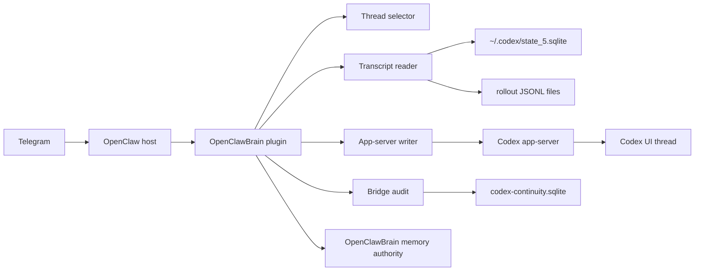

# Codex Telegram Full Bridge Plan

Status: implementation plan, with Phase 1-5 existing-thread bridge shipped in `openclawbrain@0.2.33`
Date: 2026-05-11, updated 2026-05-12
Owner: OpenClawBrain

## 2026-05-12 Implementation Update

`openclawbrain@0.2.33` implements the core bridge without modifying OpenClaw core:

- reads `threads.rollout_path` from `~/.codex/state_5.sqlite`;
- parses rollout JSONL `response_item` final user/assistant messages and event fallbacks;
- exposes `/brain codex messages`, `last`, `bind`, `binding`, `unbind`, `detach`, `tail`, `watch --messages`, `watches`, `unwatch`, `note`, `notes`, `act`, `reply`, `send`, `steer`, `doctor`, `status`, `threads`, and `handoff`;
- forwards watched completed assistant messages with parse/delivery cursors, dedupe, pending delivery records, retry behavior, redacted/raw/metadata forwarding modes, quieter terminal-watch defaults, and TTLs;
- stores passive operator notes locally without starting Codex;
- sends explicit trusted actions through Codex app-server `thread/resume` plus `turn/start`;
- steers active in-progress Codex turns through app-server `turn/steer`;
- refuses `--latest` writes and high-risk Telegram requests by default;
- keeps public writes disabled by default while allowing Jonathan's local profiles to enable the happy path with trusted sender/chat and repo allowlists.

Future phases remain new-thread goal creation, richer event subscription, and optional Codex-side companion if polling plus app-server access are not enough.

## Executive Summary

The current OpenClawBrain Codex continuity feature is useful, but it is only half of the bridge Jonathan actually wants.

Today it can answer:

- What Codex threads/goals are visible?
- Which goal looks active or complete?
- Can OpenClaw send a quiet completion/blocker notification?
- Can OpenClaw produce a conservative handoff brief?

It cannot yet answer the two most important Telegram operator questions:

- "What did Codex just say in that UI thread?"
- "Send this exact message into that Codex UI thread as if I were at the computer."

That means the current bridge is not good enough for the mobile workflow. It watches metadata, not the conversation. It refuses writes. It sees goals, not the actual recent messages.

The product target should be:

> OpenClawBrain lets Telegram act as a low-bandwidth remote console for Codex UI threads: read recent Codex messages directly, forward selected new messages to Telegram, and send user messages into a specific Codex thread through the Codex app-server, without modifying OpenClaw core and without storing raw Codex telemetry as durable memory.

## What The Pre-0.2.30 Code Showed

### OpenClawBrain Current State

File: `/Users/guclaw/.openclaw/workspace/openclawbrain/packages/openclaw-plugin/src/codex-continuity.ts`

Before the 0.2.30 implementation, the bridge did these things:

- Reads `~/.codex/state_5.sqlite`.
- Queries `threads` and `thread_goals`.
- Returns thread id, title, cwd, branch, model, reasoning effort, goal objective, and goal status.
- Labels SQLite fallback as stale/read-only.
- Supports `/brain codex status`.
- Supports `/brain codex threads`.
- Supports `/brain codex watch`.
- Supports `/brain codex handoff`.
- Stores bridge-local watches and redacted bridge events.
- Refuses `/brain codex goal` and `/brain codex steer` unless write feature flags are enabled, and even then the implementation still returns "not enabled in this build path."

Before the 0.2.30 implementation, the bridge did not:

- Read `threads.rollout_path`.
- Parse the per-thread Codex transcript JSONL.
- Return recent user/assistant messages.
- Tail message changes.
- Forward assistant messages to Telegram.
- Connect to Codex app-server directly.
- Call `thread/resume`.
- Call `turn/start`.
- Call `turn/steer`.
- Write user text into a Codex thread.

### Codex Local State Has The Missing Transcript Pointer

SQLite table: `/Users/guclaw/.codex/state_5.sqlite`

The `threads` table includes a `rollout_path` column. The current OpenClawBrain query ignores it.

Example local path:

```text
/Users/guclaw/.codex/sessions/2026/05/08/rollout-2026-05-08T09-50-06-019e087f-152a-7300-99c1-8623f0152f39.jsonl
```

Those rollout JSONL files contain the actual thread transcript records. The useful message records include:

- `response_item` with `payload.type == "message"`
- `payload.role == "user"` or `payload.role == "assistant"`
- content items such as `input_text` and `output_text`
- `event_msg` records such as `user_message` and `agent_message`

This means recent Codex messages can be copied directly from local files. No LLM call is needed to paste recent messages into Telegram. In fact, using an LLM for this would be worse: slower, more expensive, and more likely to paraphrase when Jonathan wants exact thread text.

### OpenClaw Codex Extension Already Has The Write Surface

Files inspected:

- `/Users/guclaw/openclaw/extensions/codex/src/app-server/protocol.ts`
- `/Users/guclaw/openclaw/extensions/codex/src/app-server/client.ts`
- `/Users/guclaw/openclaw/extensions/codex/src/app-server/request.ts`
- `/Users/guclaw/openclaw/extensions/codex/src/app-server/thread-lifecycle.ts`
- `/Users/guclaw/openclaw/extensions/codex/src/app-server/run-attempt.ts`
- `/Users/guclaw/openclaw/extensions/codex/src/conversation-binding.ts`
- `/Users/guclaw/openclaw/extensions/codex/src/conversation-control.ts`
- `/Users/guclaw/openclaw/extensions/codex/src/command-handlers.ts`

The Codex app-server protocol supports:

- `thread/list`
- `thread/start`
- `thread/resume`
- `turn/start`
- `turn/steer`
- `turn/interrupt`
- `turn/completed` notifications
- `item/agentMessage/delta` notifications
- `item/completed` notifications

The OpenClaw Codex extension already has a native conversation binding:

- `/codex threads`
- `/codex resume <thread-id>`
- `/codex bind [thread-id]`
- `/codex detach`
- `/codex binding`
- `/codex stop`
- `/codex steer <message>`

The implementation now uses that path: `reply`/`send` call `turn/start`, while `steer` calls `turn/steer` only when an active in-progress turn id is visible.

## Verdict

Jonathan is right: the current Codex continuity feature is incomplete.

The current implementation is a status mirror. The desired product is a thread bridge.

The missing pieces are:

1. Recent message read/copy.
2. Message-level watches.
3. Direct Telegram-to-Codex thread writes.
4. Specific thread targeting.
5. Safe provenance, confirmation, and audit.
6. A clear decision on whether OpenClawBrain talks to Codex app-server directly or through a Codex-side companion.

## Do We Need A Codex Plugin Too?

Not immediately for the first useful version. Possibly yes for the best long-term version.

There are three implementation options.

### Option A: OpenClawBrain-Only Bridge

OpenClawBrain reads:

- `~/.codex/state_5.sqlite`
- `threads.rollout_path`
- per-thread rollout JSONL

OpenClawBrain writes:

- to Codex app-server using a small local JSON-RPC client
- never to SQLite
- never to rollout JSONL

Pros:

- No OpenClaw core changes.
- No Codex plugin install required.
- Fits the current OpenClawBrain package boundary.
- Can ship quickly.
- Directly solves recent-message copy and basic send-to-thread.

Cons:

- Polling JSONL is less elegant than event subscription.
- The app-server protocol is not a formal public API.
- OpenClawBrain must implement a small protocol adapter and capability detection.
- It may not perfectly match UI state if Codex Desktop changes how it persists transcripts.

### Option B: Reuse The OpenClaw Codex Extension More Directly

OpenClawBrain could delegate writes to the already-installed OpenClaw Codex extension.

Pros:

- Avoids duplicating app-server protocol code.
- Reuses existing `thread/resume`, `turn/start`, `turn/steer`, and collector logic.
- Stays aligned with OpenClaw's Codex host behavior.

Cons:

- OpenClawBrain package does not currently depend on OpenClaw extension internals.
- Importing from `/Users/guclaw/openclaw/extensions/codex` would make the plugin brittle and personal-machine-specific.
- ClawHub/public package should not rely on local OpenClaw source paths.

This is useful as reference, not as the shipped dependency path.

### Option C: Codex-Side Companion Plugin

Build an OpenClawBrain-owned Codex companion plugin/tool that runs on the Codex side and exposes a stable local bridge API:

- list threads
- read recent messages
- subscribe to new assistant messages
- submit a user message
- return turn completion text

Pros:

- Best long-term architecture.
- Codex-side code can see the live app-server event stream cleanly.
- Less polling.
- Cleaner "UI thread to Telegram" parity.
- Easier to keep message watches exact and low-latency.

Cons:

- More moving parts.
- Requires Codex plugin install/update workflow.
- Needs careful auth between OpenClawBrain and the companion.
- May be too much before the basic bridge is working.

### Recommendation

Build Option A first, designed so Option C can replace the internals later.

The first release should be an OpenClawBrain-owned bridge with:

- transcript reader from SQLite `rollout_path` plus JSONL
- message-level Telegram commands
- message-level watches
- app-server write client behind feature flags
- strong provenance and audit

Then build the Codex-side companion only if polling JSONL and app-server requests are not reliable enough.

## Product Contract

Telegram is not a second Codex UI.

Telegram should become:

- a remote status console
- a recent-message viewer
- a selective assistant-message mirror
- a way to send concise instructions into an exact Codex thread
- a way to ask OpenClawBrain what happened and why it notified or stayed quiet

Telegram should not become:

- a raw stream of every tool call
- a full code review surface
- an unguarded remote executor
- a place where every Codex delta appears
- a durable store of all Codex transcript data

## Hardened Implementation Contract

This revision tightens the first plan around the main critique: the read lane is implementable with modest risk, but the write lane is remote control of a local coding agent and must have a stricter contract.

### MVP Boundary

The first useful implementation should be:

- `/brain codex threads`
- `/brain codex messages`
- `/brain codex last`
- `/brain codex bind`
- `/brain codex tail`
- `/brain codex watches`
- `/brain codex unwatch`

Then add `/brain codex reply` only after binding, write policy, app-server capability detection, confirmation, idempotency, and audit are implemented.

The `0.2.33` implementation adds active-turn steering after the bound/exact write path, with a strict no-active-turn refusal. New-thread goal creation remains outside the shipped bridge.

### Exact Copy Semantics

"Exact copy" means:

- exact textual content extracted from final user/assistant message payloads;
- normalized only for Telegram-safe escaping, chunking, and transport limits;
- not paraphrased, summarized, reordered, interpreted, or semantically transformed;
- not guaranteed to reproduce Codex UI layout, hidden metadata, tool panels, screenshots, reasoning records, or intermediate deltas.

Every output must make clear whether it is:

- copied Codex message text;
- bridge metadata;
- OpenClawBrain interpretation;
- LLM-generated summary, when explicitly requested.

Direct message copy must not call an LLM. Summaries and handoffs may call an LLM only when the command semantics explicitly request summarization, and they must label copied text versus interpretation.

### Read Targets Versus Write Targets

Read commands may support `--latest`, fuzzy filters, and heuristic target suggestions, as long as the selected thread is clearly labeled.

Write commands must not execute against fuzzy or heuristic targets.

For writes, the final target must be one of:

- explicit full thread id;
- explicit bound thread for the same Telegram chat;
- confirmed pending target tied to a confirmation id;
- short alias generated by `/brain codex threads`, if unique and unexpired.

The bridge must not execute a write against `--latest`, latest updated thread, latest active goal, fuzzy title match, or repo heuristic. Those signals may propose a target, but they cannot authorize a write.

### Parser Precedence

The transcript parser should treat sources in this order:

1. Primary: `response_item` with `payload.type == "message"`, role `user` or `assistant`, and content items `input_text` or `output_text`.
2. Fallback: `event_msg` with `payload.type == "user_message"` or `payload.type == "agent_message"`, only when no equivalent primary record exists.
3. Optional explicit mode: tool output, deltas, reasoning, and event chatter.

Default watches forward only completed assistant messages. Streaming deltas are ignored unless the user explicitly asks for live deltas.

Malformed JSONL handling:

- if the final line is malformed, treat it as a partial append and do not advance the parse cursor past it;
- if a non-final line is malformed, record a redacted parser error event and continue;
- if the file is replaced/truncated, reset through a file identity check and avoid replay spam.

### Delivery Reliability

Parsing and delivery need separate state.

- `parse_cursor`: how far the rollout file has been safely scanned.
- `delivery_cursor`: last message successfully delivered to Telegram.
- `pending_delivery`: parsed message chunks not yet fully delivered.

The bridge must not lose a message because Telegram delivery failed after parsing. It also must not blindly resend all chunks on restart.

### Storage Tiers

There are three storage categories:

1. Bridge-local operational DB: may store thread ids, local rollout paths, cursor state, delivery state, provenance, and redacted previews because it needs restart recovery.
2. Operator/audit surfaces: should expose redacted, privacy-tiered summaries and may hash sensitive identifiers.
3. Durable OpenClawBrain memory: must not store raw Codex transcript, tool output, full diffs, secrets, or unapproved private message text.

A local rollout path may be stored in the bridge DB when necessary for restart recovery. It must not be exported to memory, telemetry, public docs, remote logs, or broad audit views unless explicitly approved.

### App-Server Connection Contract

Before write support, the bridge must document and test:

- discovery method;
- transport;
- auth or local trust boundary;
- protocol version or user-agent check;
- request timeout;
- retry policy;
- single-instance versus multi-instance behavior;
- expected error shapes;
- behavior when the target thread is active;
- behavior when the target thread is missing or archived;
- behavior when Codex UI/app-server is unavailable;
- behavior when `thread/resume`, `turn/start`, or `turn/steer` is unsupported.

If the app-server request times out after an ambiguous write attempt, do not auto-retry `turn/start`. Mark the outbound message `possibly_sent` and ask the operator to inspect.

### Confirmation State Machine

Ambiguous or risky writes require a first-class confirmation record:

```json
{
  "confirmationId": "...",
  "chatIdHash": "...",
  "senderIdHash": "...",
  "targetThreadId": "...",
  "messageHash": "...",
  "riskClass": "low|medium|high",
  "state": "pending|confirmed|rejected|expired|superseded",
  "expiresAt": "..."
}
```

Rules:

- confirmation expires quickly;
- confirmation must come from the same trusted sender and chat;
- confirmation must reference the confirmation id or use a safe inline action;
- if the original message text changes, confirmation is invalid;
- a newer pending confirmation supersedes older ambiguous confirmations unless explicitly selected.

### Write Policy Matrix

Default policy:

| Request type | Example | Telegram behavior |
| --- | --- | --- |
| Low-risk conversational | "What is your status?" | Allow only for bound/exact targets |
| Read-only coding | "Explain the current failure" | Allow only for bound/exact targets |
| Local edit | "Patch the parser" | Allow only if repo is write-allowlisted; Codex approvals still apply |
| Test/run command | "Run tests" | Allow only if repo is write-allowlisted; Codex approvals still apply |
| Destructive local action | "Delete generated files" | Require second confirmation or refuse |
| Secrets/credentials | "Update the token" | Refuse from Telegram by default |
| External publication | "Publish/deploy/push package" | Refuse from Telegram by default unless a separate high-risk flag is enabled |
| Full-access/yolo | "Turn on full access" | Refuse from Telegram by default |

Use separate allowlists:

```toml
codexBridge.readAllowlist = []
codexBridge.writeAllowlist = []
codexBridge.destructiveWriteAllowlist = []
```

High-risk writes are refused from Telegram by default unless `codexBridge.highRiskTelegramWrites = true`. Even then, they require second confirmation and must still pass Codex's local approval/sandbox flow.

### HTTP Route Hardening

Mutating routes must:

- be disabled unless `codexBridge.enableTelegramWrites = true`;
- bind only to localhost or a Unix domain socket by default;
- require a per-profile secret or signed request;
- reject browser-originated requests unless explicitly configured;
- enforce `Content-Type`;
- enforce request body size limits;
- require idempotency keys;
- never mutate via GET;
- reject unauthenticated LAN access;
- record provenance for every accepted or rejected request.

This is also a CSRF defense. A random webpage must not be able to POST to a local bridge endpoint and make Codex act.

### Telegram Formatting

Default forwarding should use plain text, not MarkdownV2. The bridge should:

- prefix chunks like `[1/3]`;
- preserve code fences as text;
- cap total forwarded size unless `--full` is provided;
- avoid splitting inside Unicode grapheme clusters;
- provide a clear truncation notice;
- avoid previewing suspected secrets in redacted mode.

"Exact" means exact text content after extraction, not exact Telegram rendering.

### Secret And Telegram Disclosure Modes

Telegram is an external durable store. Forwarding raw Codex text to Telegram exports that content outside OpenClawBrain, even if OpenClawBrain does not store it.

The bridge cannot guarantee automatic secret detection. Redaction reduces risk, but it is not a proof.

Modes:

```toml
codexBridge.telegramForwardingMode = "redacted"      # public default
codexBridge.telegramForwardingMode = "raw_trusted"   # Jonathan local trusted mode
codexBridge.telegramForwardingMode = "metadata_only" # safest
```

### Transcript Text Is Inert

Copied Codex text must never be interpreted as a bridge instruction.

Only explicit `/brain codex reply`, `/brain codex send`, approved inline action, or explicit bound reply mode can send text to Codex. A plain Telegram reply to a forwarded transcript message should not become a Codex instruction by accident.

## Architecture



The bridge should have two separate lanes.

### Lane 1: Transcript Lane

Purpose: read and forward messages.

Data source:

- SQLite thread metadata
- `threads.rollout_path`
- rollout JSONL files
- optional app-server event stream later

Rules:

- Direct copy by default.
- No LLM call for message copy.
- Do not summarize unless the user explicitly asks for a summary.
- Do not store raw transcript as durable memory.
- Store only cursors, hashes, thread refs, and redacted audit snippets.
- Omit system/developer instructions by default.
- Omit reasoning/tool chatter by default.
- Include tool output only when explicitly requested.

### Lane 2: Control Lane

Purpose: send user text to a specific Codex thread.

Write path:

- `thread/resume` to confirm target exists
- `turn/start` to submit a new user message to an idle thread
- `turn/steer` only for an active turn with known `expectedTurnId`
- `turn/interrupt` only behind explicit confirmation

Rules:

- Never write SQLite.
- Never write rollout JSONL.
- Never bypass Codex sandbox or approval behavior.
- Never enable full-access/yolo mode from Telegram by default.
- Require exact thread targeting or explicit confirmation.
- Require trusted Telegram sender.
- Require repo allowlist for side-effect-capable writes.
- Record provenance and audit.

## New Command Surface

The command namespace should stay under `/brain codex` so the user does not need to remember which plugin owns the workflow.

### Read Commands

```text
/brain codex status
/brain codex threads [filter]
/brain codex messages [thread-id|--latest|--bound] [--limit 5] [--role assistant|user|all]
/brain codex last [thread-id|--latest|--bound]
/brain codex tail [thread-id|--latest|--bound] [--assistant-only]
/brain codex handoff [thread-id|--latest|--bound]
```

Behavior:

- `messages` prints recent transcript messages directly from JSONL.
- `last` prints the latest assistant message.
- `tail` creates a message-level watch that forwards new assistant messages.
- `handoff` may use transcript snippets as evidence, but it must label exact messages versus interpretation.

### Watch Commands

```text
/brain codex watch [thread-id|--latest|--bound] --terminal
/brain codex watch [thread-id|--latest|--bound] --messages
/brain codex watch [thread-id|--latest|--bound] --all
/brain codex unwatch <watch-id|thread-id>
/brain codex watches
```

Default should remain quiet:

- terminal completion
- failure
- blocker
- approval needed
- auth failure

Message watches are explicit:

- forward new assistant final messages
- optionally forward user messages sent from Codex UI
- do not forward raw tool output unless requested

### Write Commands

```text
/brain codex bind <thread-id>
/brain codex binding
/brain codex unbind
/brain codex reply <message>
/brain codex send <thread-id|--bound> <message>
/brain codex steer [thread-id|--bound] <message>
/brain codex goal [thread-id|--new] <goal text>     # later phase only
```

Behavior:

- `bind` attaches the current Telegram chat to an exact Codex thread.
- `reply` sends to the current bound thread only.
- `send` starts a new turn only for an explicit thread id or explicit bound thread.
- `steer` sends into an active running turn only when the bridge knows the active turn id, and should ship after event integration.
- `goal` submits a `/goal ...` text message or starts a new thread only after the app-server write contract and repo/cwd selection UX are proven.
- `--latest` is not allowed for writes.

Write mode should be disabled by default in the public package and enabled explicitly in Jonathan's local config.

## Transcript Reader Design

### Extend Thread Metadata

`CodexThreadSummary` needs fields like:

```ts
rolloutPath?: string;
firstUserMessage?: string;
sourcePath?: string;
```

The SQLite query should include:

```sql
t.rollout_path,
t.first_user_message,
t.thread_source
```

### Message Model

```ts
type CodexTranscriptMessage = {
  id: string;
  threadId: string;
  role: "user" | "assistant";
  text: string;
  timestamp: string;
  source: "rollout_jsonl" | "app_server";
  lineNumber?: number;
  byteOffset?: number;
  turnId?: string;
  itemId?: string;
  messageKind: "final_message" | "telegram_event" | "ui_event";
  redactedPreview: string;
};
```

### JSONL Parsing Rules

Read these by default:

- `response_item` where `payload.type == "message"`
- role `user` or `assistant`
- content item types `input_text` and `output_text`

Consider these as fallback/event evidence:

- `event_msg` with `payload.type == "user_message"`
- `event_msg` with `payload.type == "agent_message"`

Ignore by default:

- `session_meta`
- system/developer instruction blocks
- `reasoning`
- tool call records
- tool result records
- token-count events
- raw screenshots/media metadata unless explicitly requested

### Direct Copy, No LLM

When the user asks for recent messages, the bridge should:

1. Resolve the thread.
2. Read the rollout file.
3. Parse message records.
4. Filter to requested roles.
5. Chunk for Telegram limits.
6. Send exact text with minimal framing.

It should not call a model.

This is important for cost, latency, and fidelity.

## App-Server Writer Design

### Capability Detection

On startup or first write attempt, the bridge should detect:

- app-server reachable
- protocol initialized
- `thread/list` available
- `thread/resume` available
- `turn/start` available
- `turn/steer` available
- notifications available

The status payload should report:

```json
{
  "canReadThreads": true,
  "canReadMessages": true,
  "canStartTurn": true,
  "canSteerTurn": false,
  "canSubscribe": false,
  "canWrite": true
}
```

### Write Flow: Idle Thread

```mermaid
sequenceDiagram
  participant TG as Telegram
  participant OCB as OpenClawBrain
  participant SEL as Thread Selector
  participant APP as Codex App-Server
  participant UI as Codex UI

  TG->>OCB: /brain codex send thread-123 "Please continue"
  OCB->>SEL: verify target thread
  SEL-->>OCB: exact match, repo allowed
  OCB->>APP: initialize
  OCB->>APP: thread/resume(thread-123)
  APP-->>OCB: thread ok
  OCB->>APP: turn/start(thread-123, input text)
  APP-->>OCB: turn id
  APP-->>UI: new turn appears
  OCB-->>TG: Sent to Codex thread thread-123; watching reply
```

### Write Flow: Active Turn

If there is an active turn and the bridge has the active turn id:

- use `turn/steer`
- include `expectedTurnId`
- record as steer, not new turn

If there is an active turn but no known turn id:

- refuse or queue
- do not guess

Recommended behavior:

```text
That Codex thread appears active, but I do not have the active turn id.
I can queue this after completion, or you can target an idle thread.
```

### New Thread Flow

New thread creation should be later than send-to-existing-thread.

It requires:

- cwd/repo selection
- model selection or default
- sandbox and approval defaults
- feature flag
- confirmation

## Thread Selection Model

Wrong-thread writes are the main product risk.

Read selection may use convenience fallbacks:

- exact thread id;
- current Telegram conversation binding;
- explicit active watch for this Telegram chat;
- latest active goal in current repo context;
- latest updated Codex thread;
- fuzzy title/goal filter.

Write selection must be exact. A write may execute only against:

1. explicit full thread id supplied by the user;
2. current bound thread for the same Telegram chat;
3. confirmed pending target bound to a confirmation id;
4. unexpired short alias generated by `/brain codex threads`, if it maps uniquely.

The bridge must not write to `--latest`, latest active goal, fuzzy title match, latest updated thread, or repo heuristic. Those signals can propose a target requiring confirmation, but they cannot authorize a write.

Suggestion scoring should still be explainable:

```text
explicit thread id: +100
current conversation binding: +80
active watch in same Telegram chat: +70
repo/cwd matches recent OpenClaw context: +35
goal/title matches user text: +20
updated within 30 minutes: +20
active goal: +15
same branch as current worktree: +10
archived: disqualify
repo not allowlisted for writes: disqualify for writes
multiple candidates within 20 points: require confirmation
```

Confirmation should show:

```text
Target Codex thread:
Thread: 019e...
Title: Finish OpenClawBrain bridge
Repo: /Users/guclaw/.openclaw/workspace/openclawbrain
Branch: main
Updated: 6 minutes ago

Send your message there?
```

## Safety Model

Telegram-to-Codex is remote control of a local coding agent. It must be treated as high-trust but not casual.

### Required For Writes

- `codexBridge.enableTelegramWrites = true`
- trusted Telegram sender/chat id
- target thread exact or confirmed
- repo allowlist match
- app-server write capability confirmed
- provenance metadata recorded
- risk classification performed
- no SQLite write path
- no Codex approval bypass

### Provenance

Every write attempt should record:

```json
{
  "requestedBy": "telegram:Jonathan",
  "sourceMessageId": "...",
  "telegramChatId": "...",
  "targetThreadId": "...",
  "targetRepo": "...",
  "requestId": "...",
  "riskClass": "low|medium|high",
  "confirmationState": "not_required|requested|confirmed|rejected",
  "appServerMethod": "turn/start",
  "createdAt": "..."
}
```

### Risk Classes

Low:

- ask Codex for status
- paste a clarifying message
- ask for a summary
- ask Codex to continue explanation

Medium:

- ask Codex to edit files
- ask Codex to run tests
- ask Codex to publish docs
- ask Codex to open a PR

High:

- deploy
- publish packages
- delete files
- alter credentials
- trade or financial actions
- run destructive commands
- request full-access mode

High-risk requests should require an explicit second confirmation or local Mac approval. The bridge should not turn on dangerous sandbox settings from Telegram.

## Storage Rules

OpenClawBrain should not store raw Codex telemetry as durable memory.

Allowed bridge-local operational storage:

- watch id
- thread id
- rollout path when needed for local restart recovery
- rollout path hash/ref for exposed audit surfaces
- cursor line number or byte offset
- dedupe key
- redacted preview
- event class
- delivery status
- provenance

Allowed operator/audit storage:

- event class
- redacted preview
- hashed chat/sender ids where possible
- thread id or hashed thread id depending on privacy tier
- request id
- status
- error class
- timestamp

Not allowed as durable memory:

- full Codex transcript
- raw tool outputs
- full diffs
- secrets
- pasted private data
- every assistant message

Allowed durable memory only when explicitly useful:

- "Jonathan uses Codex UI as the high-bandwidth workbench."
- "Telegram/OpenClaw is Jonathan's mobile operator surface."
- "For Codex bridge notifications, prefer concise completion/failure/blocker updates."
- "Current explicit instruction overrides old bridge defaults."

Bridge-local DB is durable local storage, but it is not durable memory. It exists so the bridge can resume safely after restart. It must not be exported to OpenClawBrain memory capture, public pages, telemetry, or remote logs.

## Schema Additions

Extend bridge state with:

```sql
CREATE TABLE codex_message_cursors (
  id TEXT PRIMARY KEY,
  agent_id TEXT NOT NULL,
  watch_id TEXT,
  thread_id TEXT NOT NULL,
  rollout_path TEXT NOT NULL,
  rollout_path_hash TEXT NOT NULL,
  parse_cursor_line INTEGER NOT NULL DEFAULT 0,
  parse_cursor_byte_offset INTEGER NOT NULL DEFAULT 0,
  delivery_cursor_line INTEGER NOT NULL DEFAULT 0,
  delivery_cursor_byte_offset INTEGER NOT NULL DEFAULT 0,
  last_message_id TEXT,
  last_message_hash TEXT,
  file_identity TEXT,
  created_at TEXT NOT NULL,
  updated_at TEXT NOT NULL
);
```

```sql
CREATE TABLE codex_pending_deliveries (
  id TEXT PRIMARY KEY,
  watch_id TEXT NOT NULL,
  thread_id TEXT NOT NULL,
  message_id TEXT,
  message_hash TEXT NOT NULL,
  source_line INTEGER,
  source_byte_offset INTEGER,
  telegram_chat_id_hash TEXT NOT NULL,
  status TEXT NOT NULL,
  attempt_count INTEGER NOT NULL DEFAULT 0,
  last_error TEXT,
  created_at TEXT NOT NULL,
  updated_at TEXT NOT NULL
);
```

```sql
CREATE TABLE codex_outbound_messages (
  id TEXT PRIMARY KEY,
  agent_id TEXT NOT NULL,
  source_channel TEXT NOT NULL,
  source_sender TEXT NOT NULL,
  source_message_id TEXT,
  thread_id TEXT NOT NULL,
  repo_path TEXT,
  risk_class TEXT NOT NULL,
  confirmation_state TEXT NOT NULL,
  app_server_method TEXT,
  app_server_turn_id TEXT,
  status TEXT NOT NULL,
  redacted_preview TEXT NOT NULL,
  error TEXT,
  created_at TEXT NOT NULL,
  updated_at TEXT NOT NULL
);
```

```sql
CREATE TABLE codex_pending_confirmations (
  id TEXT PRIMARY KEY,
  agent_id TEXT NOT NULL,
  source_channel TEXT NOT NULL,
  source_sender_hash TEXT NOT NULL,
  source_chat_id_hash TEXT NOT NULL,
  target_thread_id TEXT NOT NULL,
  message_hash TEXT NOT NULL,
  risk_class TEXT NOT NULL,
  status TEXT NOT NULL,
  expires_at TEXT NOT NULL,
  created_at TEXT NOT NULL,
  updated_at TEXT NOT NULL
);
```

Extend watches:

```text
allowed_classes:
  completion
  failure
  blocker
  approval_required
  auth_failure
  assistant_message
  user_message
  turn_started
  turn_completed

verbosity:
  terminal_only
  assistant_messages
  messages_and_terminal
  explicit_all
```

## HTTP Routes

Add routes:

```text
GET  /plugins/openclawbrain/codex/messages?threadId=...&limit=...
POST /plugins/openclawbrain/codex/watch-messages
POST /plugins/openclawbrain/codex/send
POST /plugins/openclawbrain/codex/steer
GET  /plugins/openclawbrain/codex/explain-last
```

Mutating routes must be disabled unless write mode is explicitly enabled. When enabled, they must bind only to localhost or a Unix socket by default, require a per-profile secret or signed request, reject browser-originated requests unless explicitly configured, enforce request body limits, require idempotency keys, and record provenance for both accepted and rejected writes.

## Implementation Phases

### Phase 0: Capability And Fixture Audit

Goal: remove guesswork before writing product code.

Work:

- Capture several real rollout JSONL fixtures.
- Document actual message, event, delta, partial-line, and completion record variants.
- Document app-server discovery, initialize, `thread/resume`, `turn/start`, and error shapes.
- Define exact-copy semantics in tests.
- Define local bridge DB versus audit versus memory privacy tiers.
- Decide default Telegram forwarding mode.

Tests:

- Fixture parser can read captured records without relying on the live machine.
- App-server mock includes protocol version/capability responses and common failure shapes.

### Phase 1: Read-Only Transcript Commands

Goal: make Telegram able to read recent Codex messages.

Work:

- Add `rolloutPath` to `CodexThreadSummary`.
- Read `threads.rollout_path` from SQLite.
- Implement `CodexTranscriptReader`.
- Parse rollout JSONL message records.
- Add exact/direct formatting.
- Add chunking for Telegram.
- Add `/brain codex messages`.
- Add `/brain codex last`.
- Add HTTP `GET /codex/messages`.

Tests:

- JSONL fixture with user/assistant messages.
- Duplicate `response_item` and `event_msg` with same text.
- Assistant delta followed by final assistant message.
- Partial trailing JSONL line.
- Truncated or replaced file.
- Ignores session/system/reasoning/tool records by default.
- Includes tool output only with explicit flag.
- Redacts previews in audit.
- Does not call an LLM for message copy.
- Handles missing rollout file.
- Handles malformed JSONL lines.
- Chunks long messages.
- Handles Unicode and code-block chunking.
- Handles secret-like content under redacted mode.
- Handles multiple content parts and empty assistant content.

### Phase 2: Message Watches

Goal: forward selected new Codex messages to Telegram.

Work:

- Add message watch mode.
- Add parse cursor, delivery cursor, and pending-delivery tables.
- Add assistant-message event class.
- Poll watched rollout files.
- Send only new assistant final messages by default.
- Dedupe by message id/hash/line.
- Add `/brain codex tail`.
- Add `/brain codex watch --messages`.
- Add `/brain codex watches` and `/brain codex unwatch`.

Tests:

- No duplicate forwards.
- Cursor resumes after restart.
- Cursor does not advance delivery state before successful Telegram delivery.
- Telegram delivery succeeds for chunk 1 and fails for chunk 2.
- Restart with pending delivery.
- Watch target rollout path changes.
- Telegram send failure records event and retries safely.
- Watch expiry works.
- Two watches on the same thread in different chats.
- Same chat watches two threads.
- Sensitive watch mode suppresses content.
- Terminal-only watch does not send ordinary messages.

### Phase 3: Binding And Safe Target Selection

Goal: make writes safe before writes exist.

Work:

- Add `/brain codex bind <thread-id>`.
- Add `/brain codex binding`.
- Add `/brain codex unbind`.
- Store Telegram-chat-to-thread binding in bridge state.
- Add unexpired short aliases generated by `/brain codex threads`.
- Implement suggestion scoring for read-only target proposals.
- Implement confirmation state machine.
- Add explain output for why a target was selected or rejected.
- Refuse write target resolution through `--latest`.

Tests:

- Exact thread id wins.
- Bound conversation wins.
- Expired alias is rejected.
- Active watch may suggest but not authorize writes.
- Multiple close candidates require confirmation.
- Confirmation expires.
- Confirmation from wrong sender/chat is rejected.
- Message text changed between confirmation and send invalidates confirmation.
- Archived threads rejected.
- Wrong repo rejected for writes.

### Phase 4: Send To Idle Bound/Exact Thread

Goal: send Telegram text into an existing Codex thread.

Work:

- Implement minimal app-server JSON-RPC client inside OpenClawBrain.
- Initialize client with clientInfo.
- Detect `thread/resume` and `turn/start`.
- Add `/brain codex reply <message>` for bound thread.
- Add `/brain codex send <thread-id> <message>` for explicit thread id.
- Resume target thread before sending.
- Start turn with `{ type: "text", text, text_elements: [] }`.
- Return accepted turn id.
- Set up optional temporary reply watch.
- Record outbound provenance.
- Add idempotency key handling.
- Mark ambiguous timeout as `possibly_sent` instead of retrying.

Tests:

- Mock app-server happy path.
- App-server unavailable.
- Method missing.
- Thread not found.
- Repo not allowlisted.
- Sender not trusted.
- Feature flag off.
- Ambiguous target.
- App-server timeout after possible successful write.
- Duplicate retry prevention.
- Thread id exists in SQLite but not app-server.
- High-risk request refused or requires second confirmation.
- Attempt to enable full-access/yolo mode from Telegram rejected.
- Outbound audit redacts preview.
- SQLite never used as write path.
- JSONL never used as write path.

### Phase 5: App-Server Event Integration

Goal: track live turn state reliably before steering.

Work:

- Subscribe to app-server notifications when available.
- Track active turn ids for turns started by OpenClawBrain.
- Track completion, failure, assistant final message, and approval-needed events.
- Reconcile app-server events with JSONL tailing.
- If polling is not reliable enough, promote the Codex-side companion to required for active-turn features.

Tests:

- Turn completion updates watch state.
- Assistant final message is not double-forwarded when both app-server and JSONL report it.
- App-server reconnect/backfill.
- Protocol method missing.
- Malformed app-server response.

### Phase 6: Steer Active Turn

Status: shipped in `openclawbrain@0.2.33` for known active in-progress turns.

Goal: send mid-turn steering messages only when safe.

Work:

- Add `turn/steer` support for known active turn.
- Refuse steering when active turn id is unknown.
- Optionally queue message until turn completes.

Tests:

- Known active turn uses `turn/steer`.
- Unknown active thread refuses/queues.
- Expected turn id mismatch fails safely.
- Pending user-input prompt can be answered if exposed.

### Phase 7: New Thread / Goal Creation

Goal: create new Codex work from Telegram only after existing-thread bridge is trusted.

Work:

- Design repo/cwd selector.
- Design model/sandbox/approval defaults.
- Decide whether `/brain codex goal` sends `/goal ...` to an existing thread or creates a new one.
- Require explicit confirmation for new-thread creation.
- Keep high-risk publish/deploy/delete goals refused by default.

Tests:

- Repo selection ambiguous requires confirmation.
- Repo not allowlisted rejected.
- Model/sandbox defaults are visible in confirmation.
- New thread is bound only after accepted by app-server.

### Phase 8: Optional Codex-Side Companion

Goal: improve reliability and live parity if polling is not enough.

Build after Phases 1-5 prove the workflow, or earlier if active-turn state and low-latency watches are not reliable through JSONL/app-server alone.

Responsibilities:

- expose stable read-message API
- expose event subscription
- expose write/turn-start API
- push assistant-message events to OpenClawBrain
- provide explicit protocol version/capability map

This should be OpenClawBrain-owned, not an OpenClaw core patch.

## Public Package Defaults

For ClawHub/public OpenClawBrain:

```toml
codexBridge.enabled = true
codexBridge.enableTelegramWrites = false
codexBridge.messageWatchesEnabled = true
codexBridge.directMessageCopyEnabled = true
codexBridge.telegramForwardingMode = "redacted"
codexBridge.storeRawTranscript = false
codexBridge.allowLatestTargetForWrites = false
codexBridge.highRiskTelegramWrites = false
```

For Jonathan's local profile:

```toml
codexBridge.enableTelegramWrites = true
codexBridge.telegramForwardingMode = "raw_trusted"
codexBridge.trustedTelegramSenders = ["<jonathan-chat-id>"]
codexBridge.readAllowlist = [
  "/Users/guclaw/.openclaw/workspace/openclawbrain",
  "/Users/guclaw/openclawbrain-site",
  "/Users/guclaw/jonathangu.github.io"
]
codexBridge.writeAllowlist = [
  "/Users/guclaw/.openclaw/workspace/openclawbrain",
  "/Users/guclaw/openclawbrain-site",
  "/Users/guclaw/jonathangu.github.io"
]
codexBridge.destructiveWriteAllowlist = []
```

The local profile can enable writes, but the package should remain safe by default.

## Non-Goals

This project should not:

- modify `/Users/guclaw/openclaw` core
- rely on dirty OpenClaw source patches
- write into Codex SQLite
- write into Codex JSONL
- stream every tool call to Telegram
- store raw Codex transcript as durable OpenClawBrain memory
- send all message copies through an LLM
- bypass Codex approval/sandbox behavior
- enable dangerous execution modes from Telegram by default

## Main Risks

### Wrong Thread

This is the biggest UX and safety risk. Exact ids, bindings, aliases, and confirmations are mandatory. `--latest` must not be accepted for writes.

### Protocol Drift

Codex app-server is real, but not guaranteed stable. The bridge needs capability detection, a connection contract, fixtures, and graceful degradation.

### Message Duplication

JSONL files contain response records, event records, deltas, retries, and partial appends. The parser must define source precedence and avoid double-sending the same assistant text.

### Privacy Leakage

Forwarding exact messages can expose secrets to Telegram. Telegram is an external durable store. Trusted personal Telegram may be acceptable, but the bridge still needs forwarding modes, sensitive watch settings, and blunt documentation that redaction is not a guarantee.

### Remote Execution

Telegram writes can ask Codex to edit files or run commands. The bridge must preserve Codex approvals and sandbox behavior, and should require confirmations for high-risk asks.

### Local Route Abuse

If mutating HTTP routes are reachable by a browser or LAN client, a malicious page or local process could try to make Codex act. Mutating routes need localhost/socket binding, secrets, origin checks, body limits, idempotency keys, and no GET mutation.

### Prompt Injection In Copied Messages

Copied Codex transcript text can contain instructions. Transcript text is inert content; the bridge must never treat forwarded Codex text as a bridge command.

## The Better Product Shape

The best UX is not "OpenClawBrain summarizes Codex."

The best UX is:

- "Show me the last thing Codex said."
- "Tail that thread."
- "Send this exact reply."
- "Steer the active turn when Codex is already moving in the right thread."
- "Tell me when it finishes or blocks."
- "Give me a handoff when I get back."

OpenClawBrain should use memory authority to decide what matters, but message copy itself should be a direct transport operation.

## Proposed Implementation Goal Command

```text
/goal Build the hardened OpenClawBrain Codex Telegram thread bridge without modifying OpenClaw core. Start by reading docs/CODEX_TELEGRAM_FULL_BRIDGE_PLAN.md and treating its hardened implementation contract as authoritative. Phase 0: capture/test real rollout JSONL fixtures, document exact-copy semantics, document the Codex app-server connection contract, and separate bridge-local DB, audit, and durable memory privacy tiers. Phase 1: implement direct read-only transcript commands from threads.rollout_path and rollout JSONL: /brain codex messages, last, and handoff evidence, with exact text copy, no LLM calls for copy, robust parser precedence, partial-line handling, redaction modes, Telegram-safe chunking, and tests. Phase 2: implement message watches/tail with parse cursor, delivery cursor, pending deliveries, dedupe, retry-safe Telegram delivery, watches/unwatch, redacted/raw_trusted/metadata_only forwarding modes, and restart tests. Phase 3: implement binding and safe target selection before any writes: /brain codex bind, binding, unbind, expiring aliases, confirmation state machine, explainable selection, and a hard rule that --latest/fuzzy/latest-goal targets may suggest but never authorize writes. Phase 4: implement feature-flagged Telegram-to-Codex writes only for explicit or bound idle threads using app-server thread/resume and turn/start, with trusted sender checks, read/write/destructive allowlists, provenance, risk policy matrix, idempotency keys, ambiguous-timeout possibly_sent handling, localhost/socket-only authenticated mutating routes, and Codex approval/sandbox preservation. Phase 5: implement /brain codex steer for exact or bound active in-progress turns using turn/steer, refusing when no active turn id is available. Keep new-thread/goal creation out of scope until repo/model/sandbox selection is solved. Never write Codex SQLite or JSONL. Never store raw Codex telemetry as durable memory. Never treat copied Codex text as bridge instruction. Add tests for transcript parsing, duplicate event/response records, deltas plus final messages, malformed/partial JSONL, Unicode/code chunking, secret redaction, message watches, pending deliveries, Telegram send failure, confirmation expiry/wrong sender/message-hash mismatch, app-server write/steer mocks, app-server timeout possibly_sent, wrong-thread prevention, feature-flag refusal, trusted sender rejection, allowlist rejection, localhost/auth route hardening, prompt-injection-in-transcript inertness, and no-LLM direct copy. Update docs and local install instructions, verify all /brain codex commands locally, install into all local OpenClaw profiles, and finish with files changed, tests run, enabled flags, disabled future phases, and remaining risks.
```
