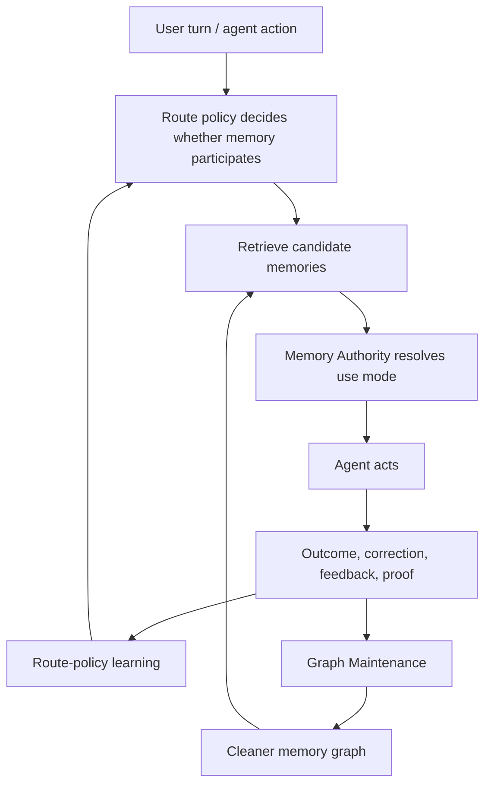
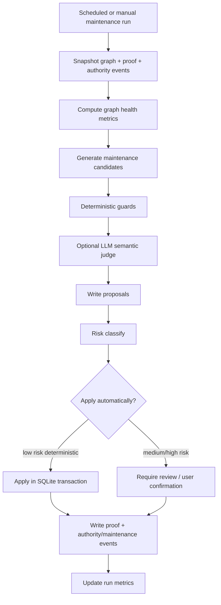

# OpenClawBrain Memory Graph Maintenance Plan

Status: design plan  
Date: 2026-05-10  
Scope: OpenClawBrain-owned graph maintenance, consolidation, repair, and feedback-driven graph evolution.

## 1. Why This Exists

OpenClawBrain now has a Memory Authority layer. That layer answers a route-time question:

> This memory is relevant, but does it have authority in this turn?

Graph maintenance answers a different question:

> After many turns, corrections, route decisions, tool outcomes, stale facts, and user overrides, how should the graph itself evolve?

Those two concerns should not be collapsed.

Memory Authority is the runtime judge. It decides whether a retrieved memory should be injected, weakened, verified, confirmed, suppressed, used only for audit, or never used.

Memory Graph Maintenance is the background curator. It keeps the graph clean, efficient, inspectable, and useful over time by merging duplicates, splitting over-broad nodes, creating better edges, removing bad edges, compacting repeated episodes into durable lessons, and preserving audit/proof lineage.

The product invariant should become:

> Never confuse relevance with authority. Never confuse graph growth with graph learning.

A graph that only grows is not learning. It is accumulating. A graph that maintains itself becomes a living memory substrate.

## 2. Research Grounding

The research points to a few durable ideas:

1. Knowledge graph refinement has two broad goals: completion and correction. It can add missing knowledge, detect wrong knowledge, target nodes/types/relations/literals, and use internal graph evidence or external sources. That maps well to OpenClawBrain maintenance: add missing useful edges, correct stale or wrong edges, and distinguish internal route evidence from environment/user evidence. Source: [Knowledge graph refinement: A survey of approaches and evaluation methods](https://journals.sagepub.com/doi/10.3233/SW-160218).

2. Truth maintenance systems preserve reasons for beliefs, revise beliefs when assumptions are contradicted, and make explanations possible. That maps directly to OpenClawBrain proof rows, authority events, supersession edges, and audit lineage. Source: [A truth maintenance system](https://www.sciencedirect.com/science/article/abs/pii/0004370279900080).

3. Temporal knowledge graph work exists because static graphs become inaccurate when facts change over time. OpenClawBrain should treat time as a first-class maintenance input, not just a rank penalty. Source: [Temporal Knowledge Graph Completion: A Survey](https://arxiv.org/abs/2201.08236).

4. Cognitive-agent frameworks separate working memory, episodic memory, semantic memory, procedural memory, and actions over memory. This supports keeping route events, proof events, durable semantic nodes, and workflow/procedural memories separate. Source: [Cognitive Architectures for Language Agents](https://arxiv.org/abs/2309.02427).

5. Agent learning can happen through feedback stored as language without updating model weights. OpenClawBrain already follows this pattern with route frames and route-policy learning; graph maintenance should do the same for node/edge evolution. Source: [Reflexion: Language Agents with Verbal Reinforcement Learning](https://arxiv.org/abs/2303.11366).

6. Generative-agent memory architectures show the value of recording experiences, reflecting over them, synthesizing higher-level memories, and retrieving them dynamically. OpenClawBrain’s version should be local, auditable, redacted, and authority-aware. Source: [Generative Agents: Interactive Simulacra of Human Behavior](https://arxiv.org/abs/2304.03442).

7. Recent work on self-evolving memory argues that agent memory needs to adapt after each interaction across continuous task streams, rather than staying as static conversational retrieval. Source: [Evo-Memory: Benchmarking LLM Agent Test-time Learning with Self-Evolving Memory](https://arxiv.org/abs/2511.20857).

The takeaway:

> OpenClawBrain needs a graph maintenance engine that treats the graph as a governed belief system with temporal validity, provenance, correction, consolidation, privacy, and feedback loops.

## 3. Current OpenClawBrain Foundation

The current codebase already has strong primitives:

- `memory_nodes`
- `memory_edges`
- `memory_nodes_v3`
- `proof_events`
- `route_frames`
- `route_frames_v3`
- `route_training_examples_v2`
- `memory_validity`
- `memory_authority_events`
- `MemoryAuthorityResolver`
- tombstone-aware retention states
- explicit authority decisions:
  - `inject`
  - `weak_context`
  - `verify_before_use`
  - `confirm_before_use`
  - `abstain`
  - `audit_only`
  - `never_use`

The missing piece is a durable maintenance loop that uses these primitives to improve the graph structure itself.

Today, many changes happen at capture time or authority-resolution time. Maintenance should run after the fact, over accumulated evidence.

## 4. Conceptual Model

OpenClawBrain should have three loops:



The three loops have separate jobs:

- Route policy decides whether to use memory at all.
- Memory Authority decides which retrieved memories have turn-level authority.
- Graph Maintenance decides how the stored graph should evolve after evidence accumulates.

## 5. What Graph Maintenance Should Do

### 5.1 Merge Duplicate Nodes

Merge candidates when:

- same `agent_id`
- same or compatible scope
- same `type`
- same `normalized_key`
- same value or semantically equivalent value
- no conflict in privacy class or retention state
- enough evidence that they represent the same durable belief

Do not destructively merge content. Create a canonical node and preserve lineage:

- old node becomes `duplicate_of` or `merged_into`
- canonical node gets reinforced evidence
- FTS/search points to canonical node
- audit/proof preserves old node ids

Required edge types:

- `duplicate_of`
- `canonical_for`
- `merged_into`
- `derived_from`

### 5.2 Split Over-Broad Nodes

Some memories look correct globally but fail in narrower scopes.

Example:

> "Jonathan prefers concise answers."

This may be true as a default but false for research memos, design docs, deep critiques, and planning.

Maintenance should split broad memories when repeated authority events show scoped exceptions:

- global preference remains as soft default
- narrower exception node is created
- exception edge links narrower node to broader node
- authority resolver gives narrower scope precedence

Required edge types:

- `exception_to`
- `scope_refines`
- `overrides_in_scope`

### 5.3 Create New Semantic Nodes From Repeated Episodes

Route frames and proof events are episodes. They should not all become durable memory. But repeated successful patterns should consolidate into semantic or procedural memory.

Example:

- Episode 1: user asks from Telegram about Codex status.
- Episode 2: user asks from Telegram whether Codex finished.
- Episode 3: user asks for concise Codex handoff.

Maintenance can propose:

> "When Jonathan is on Telegram asking about Codex, prefer concise operator summaries with status, blocker, next action, and no raw telemetry."

This is not a raw transcript. It is a distilled operating truth.

Candidate node types:

- `workflow`
- `tool_convention`
- `routing_rule`
- `preference`
- `outcome`
- `context`

### 5.4 Add Useful Edges

Edges are not decoration. They should help retrieval, authority, explanation, or maintenance.

Useful edge families:

- `supports`: this memory strengthens another memory.
- `contradicts`: this memory conflicts with another memory.
- `supersedes`: newer memory replaces old memory.
- `exception_to`: narrower memory overrides broader memory only in scope.
- `applies_to`: preference/workflow applies to project/repo/tool/person.
- `used_with`: memories were repeatedly useful together.
- `verified_by`: environment/tool/document check confirmed the memory.
- `failed_with`: memory was involved in a bad outcome.
- `derived_from`: semantic memory was distilled from episodes.
- `duplicate_of`: node is equivalent to canonical node.
- `tombstone_blocks`: tombstone prevents recapture of a subject.

Edges should carry:

- weight
- evidence count
- first seen
- last reinforced
- last contradicted
- authority effect
- proof event ids

### 5.5 Delete or Retire Bad Edges

Maintenance must delete, retire, or weaken edges too.

Bad edge cases:

- accidental co-occurrence edge from one turn
- stale `used_with` edge after route feedback shows harm
- `applies_to` edge attached to wrong repo/project
- `supports` edge contradicted by user correction
- duplicate edge after canonical merge
- edge pointing to tombstoned/hard-deleted content
- edge that increases retrieval fan-out without improving outcomes

Deletion should usually mean soft retirement:

- `retired_at`
- `retired_reason`
- `last_evidence_id`

Hard deletion is appropriate for privacy-sensitive or tombstoned content.

### 5.6 Reweight Nodes and Edges

Not all maintenance is create/delete. Much of it is reweighting.

Node-level maintenance:

- increase `importance` after repeated confirmed usefulness
- lower `current_validity_score` when stale or contradicted
- lower `behavioral_authority_score` after over-application
- preserve `evidence_confidence` when the original capture remains historically true

Edge-level maintenance:

- increase `used_with` after repeated accepted co-injection
- decrease `used_with` after prompt bloat or correction
- increase `exception_to` after scoped override repeats
- strengthen `verified_by` after deterministic checks
- weaken `applies_to` after environment mismatch

Important:

> Decay authority and validity, not historical evidence confidence.

### 5.7 Maintain Tombstones

Forgetting must block recapture.

Maintenance should:

- scan capture candidates against tombstone keys
- reject recapture attempts
- record tombstone proof events
- detect accidental duplicate tombstones
- redact/hard-delete sensitive content when required

Tombstones should preserve only safe blocking keys, never the sensitive content itself.

### 5.8 Maintain Search and Retrieval Health

Maintenance should improve retrieval without prompt flooding.

Rules:

- search seeds first, graph second
- graph edges boost/suppress/rerank seed memories
- graph traversal should not pull unbounded related memories into prompt context
- high-degree nodes need caps
- weak edges should not expand context

Graph maintenance should measure:

- retrieval precision proxy
- average graph expansion size
- number of candidates suppressed by authority
- number of injected memories corrected by user
- number of relevant memories withheld but later needed

## 6. Proposed Component: GraphMaintenanceEngine

Add a new component:

```text
GraphMaintenanceEngine
```

Its job:

> Consume proof events, authority events, route frames, route outcomes, memory nodes, and memory edges; propose graph changes; apply safe changes; leave proof.

It should be explicitly separate from `MemoryAuthorityResolver`.

### 6.1 Inputs

- `memory_nodes`
- `memory_edges`
- `memory_validity`
- `memory_authority_events`
- `proof_events`
- `route_frames`
- `route_frames_v3`
- `route_training_examples_v2`
- current config
- tombstones
- environment verification results
- user-approved maintenance commands

### 6.2 Outputs

- new canonical memory nodes
- new edge observations
- merged-node lineage
- retired edges
- updated node validity scores
- updated edge weights
- tombstone recapture blocks
- graph maintenance proof events
- graph health metrics

### 6.3 Operating Modes

1. Dry run:
   - propose changes
   - apply nothing
   - show risk and evidence

2. Safe auto:
   - apply deterministic low-risk changes
   - examples: duplicate exact same key/value, stale edge retirement, FTS repair

3. Approval required:
   - propose semantic merges, broad splits, privacy changes, high-impact supersession
   - ask user or require admin route

4. Off:
   - only collect graph health metrics

## 7. Proposed Schema Additions

### 7.1 Graph Maintenance Runs

```sql
CREATE TABLE IF NOT EXISTS graph_maintenance_runs (
  id TEXT PRIMARY KEY,
  agent_id TEXT NOT NULL,
  mode TEXT NOT NULL,
  started_at TEXT NOT NULL,
  finished_at TEXT,
  status TEXT NOT NULL,
  input_window_start TEXT,
  input_window_end TEXT,
  nodes_scanned INTEGER NOT NULL DEFAULT 0,
  edges_scanned INTEGER NOT NULL DEFAULT 0,
  proposals_created INTEGER NOT NULL DEFAULT 0,
  proposals_applied INTEGER NOT NULL DEFAULT 0,
  proposals_rejected INTEGER NOT NULL DEFAULT 0,
  risk_summary_json TEXT NOT NULL DEFAULT '{}',
  metrics_json TEXT NOT NULL DEFAULT '{}'
);
```

### 7.2 Graph Maintenance Proposals

```sql
CREATE TABLE IF NOT EXISTS graph_maintenance_proposals (
  id TEXT PRIMARY KEY,
  run_id TEXT NOT NULL,
  agent_id TEXT NOT NULL,
  proposal_type TEXT NOT NULL,
  target_kind TEXT NOT NULL,
  target_ids_json TEXT NOT NULL,
  proposed_patch_json TEXT NOT NULL,
  evidence_json TEXT NOT NULL,
  confidence REAL NOT NULL,
  risk TEXT NOT NULL,
  status TEXT NOT NULL,
  reason TEXT,
  created_at TEXT NOT NULL,
  applied_at TEXT,
  rejected_at TEXT
);
```

Proposal types:

- `merge_nodes`
- `split_node`
- `create_node`
- `create_edge`
- `retire_edge`
- `reweight_edge`
- `update_validity`
- `supersede_node`
- `create_tombstone`
- `repair_index`
- `prune_orphan`

### 7.3 Node Lineage

```sql
CREATE TABLE IF NOT EXISTS memory_node_lineage (
  id TEXT PRIMARY KEY,
  agent_id TEXT NOT NULL,
  child_memory_id TEXT NOT NULL,
  parent_memory_id TEXT NOT NULL,
  relation TEXT NOT NULL,
  proposal_id TEXT,
  evidence_json TEXT NOT NULL DEFAULT '{}',
  created_at TEXT NOT NULL
);
```

Lineage relations:

- `merged_into`
- `split_from`
- `derived_from`
- `canonicalized_from`
- `redacted_from`

### 7.4 Edge Observations

```sql
CREATE TABLE IF NOT EXISTS memory_edge_observations (
  id TEXT PRIMARY KEY,
  agent_id TEXT NOT NULL,
  edge_id TEXT,
  from_id TEXT NOT NULL,
  to_id TEXT NOT NULL,
  relation TEXT NOT NULL,
  observation_type TEXT NOT NULL,
  delta REAL NOT NULL DEFAULT 0,
  route_id TEXT,
  proof_event_id TEXT,
  reason TEXT,
  created_at TEXT NOT NULL
);
```

Observation types:

- `co_injected_success`
- `co_injected_corrected`
- `retrieved_but_suppressed_success`
- `retrieved_but_suppressed_missed`
- `environment_verified`
- `environment_contradicted`
- `user_confirmed`
- `user_rejected`
- `scope_exception_seen`
- `duplicate_seen`

## 8. Maintenance Pipeline



### Step 1: Snapshot

Collect a bounded window:

- last N authority events
- last N proof events
- recently used memories
- recently created memories
- nodes with stale validity
- edges with low weight or high fan-out
- tombstones

### Step 2: Health Metrics

Compute:

- total nodes
- total edges
- active nodes
- soft-deleted nodes
- tombstoned subjects
- orphan active nodes
- high-degree hubs
- duplicate-key clusters
- supersession cycles
- contradiction cycles
- stale high-authority nodes
- edges to deleted/tombstoned nodes
- average retrieval fan-out
- authority suppression rate
- correction-after-injection rate
- confirmation-request rate

### Step 3: Candidate Generation

Candidate families:

- exact duplicate nodes
- near duplicate nodes
- same-key different-value conflicts
- broad preference with repeated scoped exceptions
- repeated episodic outcomes ready for semantic consolidation
- stale high-impact memories needing revalidation
- co-used memory pairs worth linking
- harmful co-used pairs worth weakening
- tombstone recapture attempts
- orphan nodes worth retaining, linking, or pruning
- old low-importance nodes worth soft deleting

### Step 4: Deterministic Guards

Code owns final transitions.

The LLM may classify semantics, but code must validate:

- no hard-deleted content revived
- no tombstoned subject recaptured
- no sensitive content leaked into proof
- no cross-agent merge unless explicitly allowed
- no broad global memory superseded by narrower local exception
- no old memory made more authoritative without evidence
- no privacy class downgraded automatically
- no merge across incompatible scopes

### Step 5: Semantic Judge

Use the LLM only for hard semantic distinctions:

- duplicate vs related
- revision vs contradiction
- exception vs supersession
- preference vs workflow vs project fact
- over-broad memory needing split
- repeated episodes deserving semantic consolidation

The LLM returns structured JSON. Code validates and either writes a proposal or rejects it.

### Step 6: Apply

Apply only in small, auditable transactions.

Every applied proposal writes:

- proposal id
- proof event
- authority event if validity changed
- lineage row if nodes merged/split/derived
- edge observation rows if edge weight changed

## 9. Feedback-Driven Edge Learning

The realized route matters.

For each turn, OpenClawBrain can observe:

- route chosen
- memories retrieved
- authority decisions
- memories injected
- memories withheld
- user correction
- tool success/failure
- final answer accepted or followed up
- route teacher verdict
- counterfactual route examples

This should update the graph.

### 9.1 Positive Signals

Create or strengthen edges when:

- two memories were injected together and the outcome was good
- a memory plus a workflow repeatedly leads to success
- a repo-scoped tool convention is verified by files
- a current instruction repeatedly acts as an exception to a soft preference
- a route teacher says a withheld memory would have helped

Possible effects:

- strengthen `used_with`
- create `supports`
- create `applies_to`
- update `last_successful_use_at`
- increase edge weight
- increase memory `behavioral_authority_score` in matching scope

### 9.2 Negative Signals

Weaken or retire edges when:

- a memory was injected and user corrected it
- graph expansion pulled irrelevant context
- a stale workflow caused wrong action
- a co-used pair repeatedly bloated prompts without benefit
- environment verification contradicts an edge
- a broad memory was over-applied to a narrow task

Possible effects:

- weaken `used_with`
- create `failed_with`
- create `exception_to`
- lower `behavioral_authority_score`
- set `confirm_before_use`
- retire bad edge

### 9.3 Missing-Memory Signals

If the route chose `no_memory`, but the user later says:

> You should have remembered X.

Maintenance should:

- create/strengthen edge from task signals to memory type
- create route training example
- increase recall priority for matching scope
- mark missed edge in proof

This connects route learning with graph learning.

## 10. Node Merge Policy

Merging should be conservative.

### Safe Merge

Auto-merge only when:

- exact same normalized key
- exact or near-exact same value
- same agent
- same memory type
- same scope or one scope is clearly duplicate
- neither node is tombstoned/hard-deleted/sensitive
- no contradiction edges between them

Action:

- choose canonical node
- combine evidence counts
- set duplicate node to `audit_only` or `duplicate_of`
- redirect active retrieval to canonical node
- preserve lineage

### Review Merge

Require review when:

- same key but changed value
- different scope
- different memory type
- one node has high authority
- one node has privacy restrictions
- one node is old but historically important

### Never Merge

Never merge when:

- one node is tombstoned/hard-deleted
- privacy classes conflict
- scopes conflict and no exception relation is clear
- merge would erase a user override
- merge would collapse a scoped exception into a global preference

## 11. Split Policy

Split when a node is too broad.

Signals:

- memory often resolves to `weak_context`
- current instruction frequently overrides it
- same memory is useful in one scope but harmful in another
- corrections mention scope words like "for this repo", "for this task", "usually", "today", "not here"
- repeated `overridden_by_current_instruction` authority events

Action:

- keep broad node as soft default
- create narrower node
- connect with `exception_to` or `scope_refines`
- lower broad node behavioral authority for matching exception scope

## 12. Edge Deletion Policy

Edges should age too.

Retire edge when:

- weight below threshold
- no reinforcement after half-life
- target node deleted/tombstoned
- edge repeatedly leads to authority suppression
- edge expands prompts but does not improve outcomes

Do not retire:

- `supersedes`
- `tombstone_blocks`
- audit lineage edges
- privacy-related edges

Those are structural history, not retrieval boosters.

## 13. Graph Health Commands

Add Telegram/operator commands:

```text
/brain graph health
/brain graph maintenance dry-run
/brain graph maintenance apply <proposal-id>
/brain graph maintenance reject <proposal-id>
/brain graph clusters
/brain graph stale
/brain graph tombstones
/brain graph explain <memory-id>
```

Add HTTP routes:

```text
GET  /plugins/openclawbrain/graph/health
GET  /plugins/openclawbrain/graph/maintenance/runs
POST /plugins/openclawbrain/graph/maintenance/dry-run
POST /plugins/openclawbrain/graph/maintenance/apply
POST /plugins/openclawbrain/graph/maintenance/reject
GET  /plugins/openclawbrain/graph/clusters
GET  /plugins/openclawbrain/graph/proposals
```

Mutation routes must require gateway/admin auth.

## 14. Public-Safe Explanation

Public copy should say:

> OpenClawBrain does not just remember more. It maintains what it remembers.

Simple explanation:

- It notices repeated useful patterns.
- It merges duplicates.
- It keeps old corrections for audit but stops obeying them when superseded.
- It separates broad preferences from local exceptions.
- It lets old tool facts become stale.
- It blocks re-learning things the user asked it to forget.
- It leaves proof for why a memory changed.

This is a key differentiator from generic memory stores:

> Generic memory systems retrieve. OpenClawBrain governs and maintains.

## 15. Implementation Phases

### Phase 1: Graph Health and Dry-Run Proposals

Add:

- `GraphMaintenanceEngine`
- health metrics
- proposal table
- dry-run route
- `/brain graph health`
- `/brain graph maintenance dry-run`

No mutation yet except proposal writes.

Tests:

- duplicate clusters detected
- stale high-authority nodes detected
- deleted-node edge detected
- tombstone recapture candidate rejected
- proof redaction

### Phase 2: Deterministic Safe Maintenance

Add auto-apply for:

- exact duplicate same-key same-value consolidation
- edge retirement when target node is deleted
- FTS/index repair
- low-weight stale `used_with` edge retirement
- authority event rollups

Tests:

- merge preserves lineage
- no hard delete revival
- no cross-scope unsafe merge
- edge retirement leaves proof
- OpenClawBrain graph route shows canonical node

### Phase 3: Feedback-Driven Edge Learning

Use route outcomes and authority events to:

- create `used_with`
- strengthen `supports`
- weaken harmful edges
- create `failed_with`
- update edge observations

Tests:

- successful co-injection strengthens edge
- correction after injection weakens edge
- route miss creates candidate edge
- repeated scoped override creates split proposal

### Phase 4: Semantic Consolidation

Use bounded LLM distillation to:

- synthesize repeated episodes into durable semantic/procedural nodes
- classify conflict relation:
  - reinforce
  - revise
  - contradict
  - exception
  - duplicate
  - unrelated
- propose splits for broad memories

Tests:

- LLM output must validate against schema
- bad output rejected
- privacy redaction enforced
- no raw Codex/OpenClaw telemetry stored as durable memory

### Phase 5: Review UI and Proof Surfaces

Expose:

- proposal list
- before/after graph diff
- explanation of why a merge/split/edge update is proposed
- apply/reject commands
- `/explain-last` integration

Tests:

- proposal serialization redacted
- apply requires auth
- rejected proposal does not mutate graph

### Phase 6: Guarded Automatic Mode

Enable low-risk maintenance on a schedule:

- daily or after N proof events
- bounded runtime
- max proposals per run
- max mutations per run
- rollback plan
- config flag default off or conservative

Config example:

```json
{
  "graphMaintenance": {
    "enabled": true,
    "mode": "safe-auto",
    "maxRunMs": 3000,
    "maxMutationsPerRun": 20,
    "semanticJudge": false,
    "requireReviewForSplits": true,
    "requireReviewForPrivacyChanges": true
  }
}
```

## 16. Evaluation Plan

The graph maintenance loop should be evaluated against replayable route/proof history.

Metrics:

- fewer duplicate active nodes
- fewer stale high-authority injections
- lower correction-after-injection rate
- lower prompt bloat
- better retrieval precision
- higher route teacher agreement
- stable or improved answer acceptance
- no tombstone recapture violations
- no raw sensitive content in maintenance proof

Replay tests:

1. Capture duplicate preference three times.
2. Maintenance proposes canonical merge.
3. Apply merge.
4. Retrieval returns canonical node once.
5. Proof shows lineage.

Conflict tests:

1. Old repo memory says npm.
2. New repo memory says pnpm.
3. Maintenance proposes supersession, not merge.
4. Authority suppresses old memory.

Exception tests:

1. Global memory says concise.
2. Multiple task events say deep critique.
3. Maintenance proposes scoped exception.
4. Authority uses exception only in matching task.

Privacy tests:

1. User says forget sensitive value.
2. Tombstone created.
3. Later candidate tries to recapture.
4. Maintenance blocks candidate.

## 17. The Key Design Choice

Do not make the graph maintenance engine an eager editor.

Make it a cautious curator:

- propose before applying
- apply only deterministic low-risk changes automatically
- preserve lineage
- preserve audit unless privacy requires redaction or hard deletion
- never let graph maintenance override the current user instruction
- never make old memory more authoritative merely because it is connected

The graph should become more efficient by learning what actually helped.

The best version is not:

> More edges, more memories, more retrieval.

It is:

> Fewer better nodes, stronger justified edges, stale authority decay, scoped exceptions, privacy-safe forgetting, and proof for every meaningful change.

## 18. Suggested Goal Command

```text
/goal Implement the OpenClawBrain Memory Graph Maintenance system. Start by reading docs/MEMORY_GRAPH_MAINTENANCE_PLAN.md, docs/MEMORY_STALENESS_DECAY_AND_FORGETTING.md, docs/LLM_ROUTE_ARCHITECTURE.md, and the current memory-store, memory-authority, memory-operations, route-learning, and proof-store code. Build a GraphMaintenanceEngine that is separate from MemoryAuthorityResolver and uses proof events, authority events, route frames, route outcomes, memory nodes, memory edges, tombstones, and validity state to maintain the graph. Add graph health metrics, dry-run maintenance proposals, node lineage, edge observations, deterministic safe maintenance for exact duplicates and bad edges, feedback-driven edge learning from realized routes, scoped split proposals for over-broad memories, tombstone recapture blocking, proof/audit events for every mutation, Telegram/operator commands under /brain graph, authenticated HTTP routes, focused tests, and docs. Keep raw telemetry out of durable memory, preserve privacy and audit boundaries, keep OpenClaw core untouched, verify locally, and publish OpenClawBrain-owned docs/site updates when complete.
```
