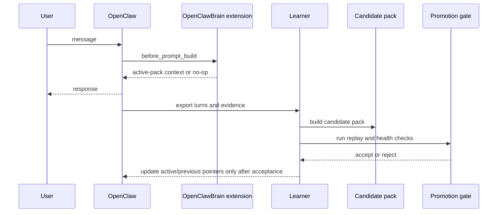

# Learning pipeline

OpenClawBrain learns off the agent's response path. The live request uses the current promoted pack, while export, candidate-pack building, and promotion run afterward.



## 1. Export turns

After the response path completes, OpenClawBrain exports turns and learning evidence. That export becomes the input for one-shot learning (`learn`) or a longer-running watch or daemon loop.

## 2. Build a candidate pack

The learner materializes a candidate pack from exported events, stored memories, and routing evidence. This work happens off the live path so the active agent request does not wait for pack construction.

## 3. Promote or reject

Candidate packs do not become live immediately. Promotion checks decide whether the new pack should replace the current active pack. If promotion is rejected, the active pack keeps serving.

## 4. Serve and rollback

When promotion succeeds:

- the candidate pack becomes the active pack
- the old active pack becomes the previous pack
- rollback can move the serve path back to the previous pack if needed

## Operator checks

Useful inspection commands:

```bash
openclawbrain learn --openclaw-home ~/.openclaw --json
openclawbrain rollback --openclaw-home ~/.openclaw --dry-run
openclawbrain daemon status --activation-root ~/.openclawbrain/activation
```

Use `learn --json` for a one-shot snapshot, `rollback --dry-run` before moving pointers, and `daemon status` when the background learner is running continuously.
