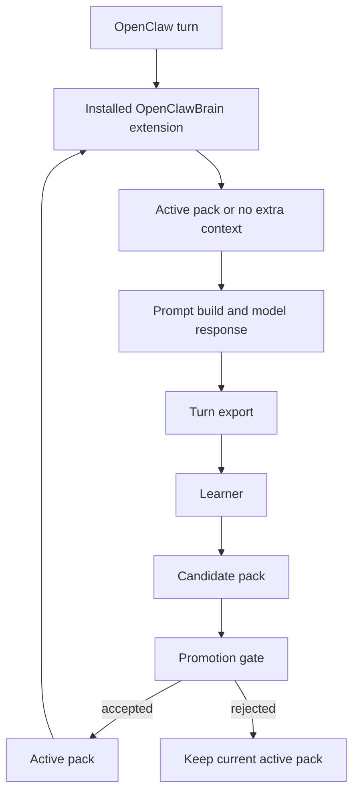

# Architecture overview

OpenClawBrain adds a learned memory layer to OpenClaw without moving learning work onto the agent's response path. Teacher v3 is the off-path compiler of graph structure and compiled artifacts; it is not the arbiter of current truth.

## Memory storage

OpenClawBrain keeps two kinds of state:

- transcript memory, which preserves raw turns and summaries for long-running sessions
- brain state, which keeps activation data, promoted packs, candidate packs, and learning metadata

Explicit user corrections are stored as durable typed memories so they can override stale recap material when the two disagree. Teacher-derived summaries and compiler outputs stay in the derivation layer; they do not become current truth by themselves.

## Retrieval

At runtime, the installed extension runs during `before_prompt_build` and calls `compileRuntimeContext()` against the current activation root. The runtime serves only promoted packs. Candidate packs and Teacher v3 outputs are built separately and stay off the live path until promotion succeeds. For the canonical target-state contract, see [Teacher v3](teacher-v3.md).

If the runtime cannot safely add context, it returns no extra context and lets OpenClaw continue. See [fail-open.md](fail-open.md).

## Learning

Learning happens after the live response path:

1. export the turn and related evidence
2. build a candidate pack from the exported material
3. compile and lint off-path Teacher v3 graph structure and derived artifacts
4. run promotion checks
5. switch the active pointer only if the candidate is accepted

The previous promoted pack stays available for rollback.

## Read next

- [learning-pipeline.md](learning-pipeline.md)
- [fail-open.md](fail-open.md)
- [graphify-bridge.md](graphify-bridge.md)
- [deep-dive.md](deep-dive.md)
